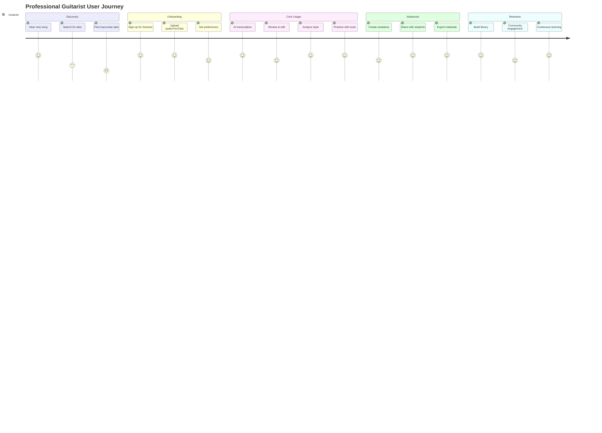

# Genesis Music Platform Development Whitepaper
# AI 기반 전문 기타 학습 플랫폼 개발 백서

## 목차

1. [Executive Summary](#executive-summary)
2. [시장 분석 및 경쟁사 리서치](#시장-분석-및-경쟁사-리서치)
3. [타겟 사용자 및 페르소나 정의](#타겟-사용자-및-페르소나-정의)
4. [핵심 기술 요구사항](#핵심-기술-요구사항)
5. [악보/Tab 렌더링 시스템 설계](#악보tab-렌더링-시스템-설계)
6. [AI 모델 및 음악 분석 시스템](#ai-모델-및-음악-분석-시스템)
7. [기술 아키텍처](#기술-아키텍처)
8. [개발 로드맵](#개발-로드맵)
9. [보안 및 성능 최적화](#보안-및-성능-최적화)
10. [비즈니스 모델 및 수익화 전략](#비즈니스-모델-및-수익화-전략)

---

## Executive Summary

### 프로젝트 비전
Genesis Music은 전문 기타리스트와 음악 교육자를 위한 차세대 AI 기반 기타 학습 플랫폼입니다. YouTube, MP3 등 다양한 음원을 AI를 통해 자동으로 정확한 악보와 Tab으로 변환하고, 70-80년대 전설적인 기타리스트들의 연주 스타일을 분석하여 학습자에게 전문적인 가이드를 제공합니다.

### 핵심 차별화 요소
1. **전문가급 악보 렌더링**: PDF 품질 수준의 오선지와 Tab 악보 렌더링
2. **AI 기반 자동 전사**: 최신 AI 모델을 활용한 정확한 음악 전사
3. **스타일 분석 엔진**: 70-80년대 기타 마스터들의 연주 스타일 분석 및 학습
4. **실시간 학습 시스템**: 진도 추적, 개인화된 학습 경로, 실시간 피드백
5. **전문가 커뮤니티**: 음악 교육자와 전문 연주자를 위한 협업 플랫폼

### 목표 시장 규모
- 글로벌 온라인 음악 교육 시장: 2024년 기준 $4.5B, 연평균 성장률 18.5%
- 기타 학습 앱 시장: $1.2B, 연평균 성장률 22.3%
- 목표 시장 점유율: 3년 내 5% (약 $60M)

---

## 시장 분석 및 경쟁사 리서치

### 1. 주요 경쟁사 분석

#### 1.1 Ultimate Guitar Pro
**개요**
- 시장 점유율: 약 35%
- 사용자 수: 1,100만+ 활성 사용자
- Tab 보유량: 약 110만개
- 가격: 월 $25 / 연 $99

**강점**
- 방대한 사용자 제작 Tab 데이터베이스
- 전문 스태프가 검증한 Pro Tab
- 다양한 악기 지원 (기타, 베이스, 드럼, 보컬)
- 강력한 재생 기능 (속도 조절, 루프, 백킹 트랙)
- 브라우저 기반 웹 애플리케이션

**약점**
- 사용자 제작 Tab의 품질 편차
- 높은 구독료
- AI 기반 자동 전사 기능 부재
- 전문가를 위한 고급 분석 기능 부족

**기술 스택**
```javascript
{
  frontend: {
    framework: "React",
    rendering: "Custom Canvas/SVG hybrid",
    audio: "Web Audio API",
    state: "Redux"
  },
  backend: {
    language: "Python/Django",
    database: "PostgreSQL",
    cache: "Redis",
    cdn: "CloudFront"
  },
  infrastructure: {
    hosting: "AWS",
    containerization: "Docker/Kubernetes",
    monitoring: "Datadog"
  }
}
```

#### 1.2 Songsterr
**개요**
- 시장 점유율: 약 20%
- 사용자 수: 500만+ 활성 사용자
- Tab 보유량: 80,000+ 곡, 400,000+ Tab
- 가격: 월 $9.99 (Plus)

**강점**
- 원음과 동기화된 재생 기능
- 정확한 포지션 표시 (원곡 연주자의 실제 운지법)
- 무료 버전에서도 재생 기능 제공
- AI 기반 YouTube → Tab 변환 (제한적)
- 저렴한 구독료

**약점**
- 상대적으로 적은 Tab 보유량
- 느린 업데이트 주기
- 20초 제한의 AI 전사 기능
- 고급 편집 기능 부재

**기술 스택**
```javascript
{
  frontend: {
    framework: "Angular",
    rendering: "SVG-based custom renderer",
    audio: "Howler.js",
    realtime: "WebSockets"
  },
  backend: {
    language: "Node.js/Express",
    database: "MongoDB",
    queue: "RabbitMQ",
    ai: "Python microservices"
  },
  ai_features: {
    transcription: "Custom CNN model",
    limitation: "20 seconds for free users",
    formats: "YouTube links only"
  }
}
```

#### 1.3 Guitar Pro
**개요**
- 시장 점유율: 약 15%
- 사용자: 전문 음악가, 교육자 중심
- 가격: 일회성 구매 $70-$200
- 버전: Guitar Pro 8 (2022 출시)

**강점**
- 전문가급 악보 편집 기능
- 고품질 사운드 엔진 (RSE - Realistic Sound Engine)
- 오프라인 작동
- MusicXML, MIDI, PDF 등 다양한 포맷 지원
- 교육 기관 표준 도구

**약점**
- 데스크톱 전용 (모바일 지원 제한적)
- 온라인 커뮤니티 기능 부족
- AI 기능 부재
- 높은 초기 비용

**기술 사양**
```cpp
{
  platform: {
    language: "C++/Qt",
    audio_engine: "RSE (Realistic Sound Engine)",
    rendering: "OpenGL accelerated",
    formats: ["GP3", "GP4", "GP5", "GPX", "GP", "MusicXML", "MIDI", "ASCII", "PDF"]
  },
  features: {
    tracks: "Unlimited",
    voices_per_track: 4,
    effects: "70+ built-in",
    soundbanks: "200+ instruments"
  }
}
```

#### 1.4 AI 기반 음악 교육 플랫폼

**Fender Play**
- 타겟: 초보자 중심
- 특징: 전통적인 비디오 레슨 방식
- 가격: 월 $19.99 / 연 $149.99
- 장점: 체계적인 커리큘럼, 고품질 비디오
- 단점: 상호작용 부족, AI 기능 제한적

**Yousician**
- 타겟: 초보-중급자
- 특징: 게임화된 학습 경험
- 가격: 월 $29.99 (Premium+)
- 장점: 실시간 피드백, 5개 악기 지원
- 단점: 전문가에게는 부족한 깊이

**Rocksmith+**
- 타겟: 게임 애호가
- 특징: Guitar Hero 스타일 인터페이스
- 가격: 월 $14.99 / 연 $99.99
- 장점: 재미있는 학습 경험
- 단점: 음악 이론 교육 부족

### 2. AI 전사 기술 현황

#### 2.1 오픈소스 모델
**Demucs (Meta)**
```python
{
  "model": "Hybrid Transformer Demucs v4",
  "architecture": {
    "type": "Hybrid (Waveform + Spectrogram)",
    "components": [
      "Temporal Convolutional Network",
      "Bi-LSTM layers",
      "Transformer attention mechanism",
      "Cross-domain fusion"
    ]
  },
  "performance": {
    "SDR": 7.08,  # Signal-to-Distortion Ratio
    "processing_time": "0.3x realtime on GPU",
    "memory_usage": "8GB VRAM recommended"
  },
  "advantages": [
    "State-of-the-art separation quality",
    "Open source and free",
    "Offline processing",
    "No data privacy concerns"
  ]
}
```

**Spleeter (Deezer)**
```python
{
  "model": "U-Net architecture",
  "stems": [2, 4, 5],  # 가능한 분리 트랙 수
  "performance": {
    "SDR": 5.91,
    "processing_time": "100x realtime on CPU",
    "memory_usage": "2GB RAM"
  },
  "integration": {
    "max_for_live": "Available",
    "docker": "Official image",
    "pip": "pip install spleeter"
  }
}
```

**Basic Pitch (Spotify)**
```python
{
  "model": "Lightweight CNN",
  "task": "Polyphonic pitch detection",
  "output": {
    "format": ["MIDI", "Note events", "Pitch contours"],
    "framerate": 22050,
    "hop_length": 256
  },
  "performance": {
    "accuracy": "87% note-level F1 score",
    "realtime_factor": 0.15,  # 매우 빠름
    "model_size": "11MB"
  }
}
```

#### 2.2 상용 솔루션

**Klangio (Guitar2Tabs)**
- 특징: 기타 특화 AI 전사
- 정확도: 85-90% (단순 멜로디), 70-75% (복잡한 코드)
- 출력: PDF, MIDI, MusicXML, Guitar Pro
- API: REST API 제공
- 가격: 월 $9.99 또는 곡당 $2.99

**AnthemScore**
- 특징: 악보 전사 특화
- 기술: Neural network + HMM
- 정확도: 90%+ (단선율), 75%+ (화음)
- 플랫폼: Windows, Mac, Linux
- 가격: $229 (Professional)

### 3. 악보 렌더링 라이브러리 비교

#### 3.1 VexFlow
```javascript
// VexFlow 5.0 특징 (2024)
const vexflowFeatures = {
  technology: {
    language: "TypeScript",
    output: ["Canvas", "SVG"],
    es_version: "ES6+",
    node_support: true
  },
  rendering: {
    notation_types: ["Standard", "Tablature", "Percussion"],
    microtonal: true,
    custom_symbols: true,
    performance: "60fps smooth scrolling"
  },
  api: {
    high_level: "EasyScore",
    low_level: "Full control API",
    extensibility: "Plugin system"
  },
  limitations: {
    musicxml: "Not native (requires converter)",
    layout: "Manual positioning required for complex scores",
    lyrics: "Limited support"
  }
};
```

#### 3.2 AlphaTab
```javascript
// AlphaTab 특징
const alphaTabFeatures = {
  technology: {
    language: "TypeScript/Haxe",
    platforms: ["Web", ".NET", "Android", "iOS"],
    output: ["Canvas", "SVG", "WebGL"]
  },
  features: {
    guitar_pro_support: ["GP3", "GP4", "GP5", "GPX", "GP7"],
    playback: "Built-in synthesizer",
    notation: "AlphaTex markup",
    performance: "GPU accelerated rendering"
  },
  audio: {
    soundfont: "SF2 support",
    midi_playback: true,
    metronome: true,
    speed_trainer: true
  },
  license: "LGPL"
};
```

#### 3.3 ABC.js
```javascript
// ABC.js 특징
const abcjsFeatures = {
  technology: {
    format: "ABC notation",
    output: ["SVG", "MIDI"],
    size: "~300KB minified"
  },
  advantages: {
    text_based: "Human readable notation",
    simple: "Easy to generate programmatically",
    compact: "Small file sizes",
    version_control: "Git-friendly"
  },
  limitations: {
    tablature: "Limited support",
    complex_notation: "Difficult to express",
    guitar_specific: "Not optimized"
  }
};
```

### 4. 시장 기회 분석

#### 4.1 미충족 니즈
1. **전문가급 도구 부재**
   - 현재 시장은 초보자 중심
   - 전문 연주자/교육자를 위한 깊이 있는 분석 도구 부족
   - 학술적 수준의 음악 분석 기능 필요

2. **AI 전사 정확도**
   - 복잡한 기타 테크닉 인식 부족 (벤딩, 비브라토, 하모닉스)
   - 다성부 음악 전사 정확도 개선 필요
   - 스타일별 뉘앙스 캡처 능력 부족

3. **렌더링 품질**
   - 인쇄 품질 수준의 악보 렌더링 부족
   - 전문 출판물 수준의 레이아웃 필요
   - 교육 자료 제작 도구 부재

4. **스타일 분석**
   - 연주자별 특징 분석 도구 부재
   - 시대별 연주 스타일 데이터베이스 부족
   - 개인화된 학습 경로 생성 미흡

---

## 타겟 사용자 및 페르소나 정의

### 1. Primary Persona: 전문 기타리스트

#### Persona 1: "Studio Session Guitarist - Michael"
```yaml
demographics:
  age: 35
  location: Los Angeles, CA
  income: $75,000-$150,000/year
  education: Music degree or equivalent experience

background:
  experience: 15+ years playing
  genres: [Rock, Blues, Jazz, Fusion]
  work: [Studio sessions, Live performances, Teaching]
  
goals:
  - 빠르고 정확한 곡 학습
  - 다양한 스타일 마스터
  - 레퍼런스 자료 구축
  - 학생 교육 자료 제작

pain_points:
  - 부정확한 온라인 Tab
  - 시간 소모적인 수동 전사
  - 스타일별 뉘앙스 파악 어려움
  - 고품질 교육 자료 제작 도구 부족

needs:
  accuracy: 95%+ 전사 정확도
  speed: 실시간에 가까운 전사 속도
  quality: 출판 품질의 악보
  analysis: 깊이 있는 음악 분석
  
tech_savviness: High
preferred_devices: [Desktop, Tablet]
budget: $50-100/month
```

#### Persona 2: "Music Educator - Sarah"
```yaml
demographics:
  age: 42
  location: Boston, MA
  income: $60,000-$90,000/year
  position: Guitar instructor at music school

background:
  students: 30-50 students
  teaching_experience: 18 years
  specialization: Classical & Contemporary guitar
  
goals:
  - 커리큘럼 개발
  - 학생별 맞춤 교재 제작
  - 진도 추적 및 평가
  - 온라인 수업 자료 준비

pain_points:
  - 수준별 교재 준비 시간
  - 학생 진도 관리 어려움
  - 저작권 문제
  - 온라인 수업 도구 통합

needs:
  library: 방대한 교육용 곡 라이브러리
  customization: 난이도 조절 가능
  tracking: 학생 진도 추적 시스템
  collaboration: 학생과 공유 기능
  printing: 고품질 인쇄 출력

tech_savviness: Medium-High
preferred_devices: [Desktop, Tablet, Smartphone]
budget: $30-50/month
```

### 2. Secondary Persona: 중급-고급 학습자

#### Persona 3: "Aspiring Professional - James"
```yaml
demographics:
  age: 24
  location: Nashville, TN
  income: $30,000-$50,000/year
  occupation: Part-time musician

background:
  experience: 8 years playing
  education: Self-taught + online courses
  goals: Professional musician
  practice_time: 4-6 hours/day

goals:
  - 프로 수준 스킬 습득
  - 유명 기타리스트 스타일 학습
  - 레퍼토리 확장
  - 음악 이론 심화

pain_points:
  - 체계적인 학습 경로 부재
  - 고급 테크닉 학습 자료 부족
  - 피드백 부재
  - 연습 효율성

needs:
  guidance: AI 기반 학습 가이드
  analysis: 연주 분석 및 피드백
  community: 전문가 멘토링
  challenges: 단계별 도전 과제

tech_savviness: Very High
preferred_devices: [Smartphone, Tablet, Desktop]
budget: $20-30/month
```

### 3. Tertiary Persona: 음악 프로듀서

#### Persona 4: "Music Producer - David"
```yaml
demographics:
  age: 38
  location: New York, NY
  income: $80,000-$200,000/year
  role: Producer & Arranger

background:
  experience: 20 years in industry
  specialization: Rock, Pop, Alternative
  studio: Professional home studio
  
goals:
  - 빠른 편곡 작업
  - 세션 뮤지션 가이드 제작
  - 레퍼런스 트랙 분석
  - 협업 도구

pain_points:
  - 세션 준비 시간
  - 뮤지션과의 의사소통
  - 버전 관리
  - 실시간 협업 도구

needs:
  speed: 즉각적인 전사 및 편집
  collaboration: 실시간 공유 및 편집
  formats: 다양한 출력 포맷
  integration: DAW 연동

tech_savviness: High
preferred_devices: [Desktop, Studio equipment]
budget: $100-200/month
```

### 4. User Journey Mapping

#### 전문 기타리스트의 Journey


---

## 핵심 기술 요구사항

### 1. 악보/Tab 렌더링 시스템 요구사항

#### 1.1 시각적 품질 요구사항
```typescript
interface RenderingQualityRequirements {
  // 해상도 및 품질
  resolution: {
    screen: "Retina/4K support",
    print: "300 DPI minimum",
    vector: "Infinite scalability via SVG"
  };
  
  // 렌더링 정확도
  accuracy: {
    spacing: "Optical spacing algorithm",
    beaming: "Automatic beam grouping",
    stems: "Correct stem direction",
    accidentals: "Smart collision avoidance"
  };
  
  // 폰트 및 심볼
  fonts: {
    music: ["Bravura", "Petaluma", "Leland"],
    text: ["System fonts", "Custom fonts"],
    tablature: "Monospace optimized"
  };
  
  // 레이아웃
  layout: {
    pagination: "Automatic page breaks",
    systems: "Dynamic system breaks",
    measures: "Elastic measure width",
    margins: "Customizable margins"
  };
}
```

#### 1.2 기능적 요구사항
```typescript
interface FunctionalRequirements {
  // 표기법 지원
  notation: {
    standard: ["Notes", "Rests", "Dynamics", "Articulations"],
    guitar: ["Tablature", "Chord diagrams", "Fingering"],
    techniques: ["Bending", "Vibrato", "Harmonics", "Tapping"],
    ornaments: ["Trills", "Mordents", "Turns", "Grace notes"]
  };
  
  // 편집 기능
  editing: {
    realtime: true,
    undo_redo: "Unlimited history",
    copy_paste: "Smart paste with transposition",
    drag_drop: "Intuitive note placement"
  };
  
  // 재생 기능
  playback: {
    engines: ["Web Audio API", "Tone.js"],
    tempo: "20-300 BPM",
    loop: "Section looping",
    metronome: "Configurable click track"
  };
  
  // 내보내기
  export: {
    formats: ["PDF", "MusicXML", "MIDI", "Guitar Pro", "PNG", "SVG"],
    quality: "Publication ready",
    options: "Customizable export settings"
  };
}
```

### 2. AI 모델 요구사항

#### 2.1 음원 분리 (Source Separation)
```python
class SourceSeparationRequirements:
    models = {
        "primary": "Demucs v4 Hybrid",
        "fallback": "Spleeter 5stems",
        "experimental": "Music Source Separation v3"
    }
    
    performance = {
        "latency": "< 0.5x realtime on GPU",
        "quality": {
            "SDR": "> 7.0 dB",
            "SIR": "> 15.0 dB", 
            "SAR": "> 10.0 dB"
        },
        "memory": "< 8GB VRAM"
    }
    
    outputs = {
        "stems": ["vocals", "drums", "bass", "guitar", "other"],
        "format": "WAV 44.1kHz 24bit",
        "isolation": "Clean guitar track for transcription"
    }
```

#### 2.2 음높이 감지 (Pitch Detection)
```python
class PitchDetectionRequirements:
    models = {
        "polyphonic": "Basic Pitch (Spotify)",
        "monophonic": "CREPE",
        "hybrid": "Custom ensemble model"
    }
    
    accuracy = {
        "single_notes": "> 95%",
        "chords": "> 85%",
        "complex_voicing": "> 75%"
    }
    
    features = {
        "onset_detection": "< 50ms accuracy",
        "velocity": "127 levels",
        "pitch_bend": "Continuous tracking",
        "vibrato": "Frequency and depth analysis"
    }
```

#### 2.3 기타 특화 전사
```python
class GuitarTranscriptionRequirements:
    techniques = {
        "bending": {
            "detection": "Pitch contour analysis",
            "types": ["half", "full", "over", "pre-bend"],
            "accuracy": "> 80%"
        },
        "vibrato": {
            "parameters": ["rate", "depth", "shape"],
            "visualization": "Waveform overlay"
        },
        "slides": {
            "types": ["legato", "shift", "glissando"],
            "direction": ["up", "down"]
        },
        "harmonics": {
            "types": ["natural", "artificial", "pinch"],
            "detection": "Spectral analysis"
        }
    }
    
    fingering = {
        "algorithm": "Dynamic programming",
        "constraints": ["Hand position", "String preference", "Playability"],
        "optimization": "Minimum movement principle"
    }
```

### 3. 스타일 분석 엔진

#### 3.1 특징 추출 (Feature Extraction)
```python
class StyleAnalysisEngine:
    def __init__(self):
        self.features = {
            "rhythmic": {
                "patterns": self.extract_rhythm_patterns(),
                "syncopation": self.measure_syncopation(),
                "groove": self.analyze_groove(),
                "timing": self.detect_timing_variations()
            },
            
            "melodic": {
                "scales": self.identify_scales(),
                "modes": self.detect_modes(),
                "intervals": self.analyze_interval_usage(),
                "phrasing": self.extract_phrase_patterns()
            },
            
            "harmonic": {
                "progressions": self.analyze_chord_progressions(),
                "voicings": self.identify_voicings(),
                "substitutions": self.detect_substitutions(),
                "extensions": self.analyze_extensions()
            },
            
            "technical": {
                "picking": self.analyze_picking_patterns(),
                "fingering": self.optimize_fingering(),
                "dynamics": self.extract_dynamics(),
                "articulation": self.detect_articulations()
            },
            
            "tonal": {
                "tone": self.analyze_tone_characteristics(),
                "effects": self.identify_effects(),
                "amp_settings": self.estimate_amp_config(),
                "signal_chain": self.reconstruct_signal_path()
            }
        }
```

#### 3.2 70-80년대 기타리스트 스타일 데이터베이스
```python
guitarist_profiles = {
    "Jimmy Page": {
        "era": "1968-1980",
        "signature_techniques": [
            "Open tunings (DADGAD, Open G)",
            "Violin bow technique",
            "Theremin integration",
            "Celtic influences"
        ],
        "tone_characteristics": {
            "amp": "Marshall Super Lead 1959",
            "effects": ["Echoplex", "Wah", "Theremin"],
            "guitars": ["Gibson Les Paul", "Fender Telecaster"]
        },
        "signature_licks": [
            {"name": "Whole Lotta Love riff", "key": "E", "pattern": "..."},
            {"name": "Black Dog riff", "key": "A", "pattern": "..."}
        ]
    },
    
    "Eric Clapton": {
        "era": "1965-1980",
        "signature_techniques": [
            "Woman tone",
            "Vibrato control",
            "Blues bending",
            "Fingerstyle integration"
        ],
        "tone_characteristics": {
            "amp": "Marshall Bluesbreaker, Fender Twin",
            "effects": ["Wah-wah", "Leslie speaker"],
            "guitars": ["Gibson SG", "Fender Stratocaster", "Gibson ES-335"]
        },
        "signature_licks": [
            {"name": "Crossroads solo", "key": "A", "pattern": "..."},
            {"name": "Layla riff", "key": "D minor", "pattern": "..."}
        ]
    },
    
    "Jimi Hendrix": {
        "era": "1966-1970",
        "signature_techniques": [
            "Thumb over neck",
            "Feedback control",
            "Whammy bar tricks",
            "Behind the back playing"
        ],
        "tone_characteristics": {
            "amp": "Marshall Super Lead, Fender Twin Reverb",
            "effects": ["Uni-Vibe", "Octavia", "Fuzz Face", "Wah"],
            "guitars": ["Fender Stratocaster (reversed)"]
        }
    },
    
    "David Gilmour": {
        "era": "1968-1980",
        "signature_techniques": [
            "Sustained bending",
            "Volume swells",
            "Delay layering",
            "Slide guitar"
        ],
        "tone_characteristics": {
            "amp": "Hiwatt DR103",
            "effects": ["Big Muff", "Phase 90", "Electric Mistress", "Binson Echorec"],
            "guitars": ["Fender Stratocaster (Black Strat)", "Gibson Les Paul"]
        }
    }
}
```

### 4. 실시간 처리 요구사항

#### 4.1 성능 목표
```typescript
interface PerformanceTargets {
  // 레이턴시
  latency: {
    audio_playback: "< 10ms",
    ui_response: "< 16ms (60fps)",
    ai_inference: "< 500ms",
    rendering: "< 100ms"
  };
  
  // 처리량
  throughput: {
    concurrent_users: 10000,
    transcriptions_per_minute: 100,
    websocket_connections: 50000
  };
  
  // 리소스 사용
  resources: {
    cpu_usage: "< 60% average",
    memory: "< 2GB per session",
    gpu_memory: "< 4GB per model",
    bandwidth: "< 1Mbps per user"
  };
  
  // 확장성
  scalability: {
    horizontal: "Auto-scaling with Kubernetes",
    vertical: "GPU cluster support",
    geographic: "Multi-region deployment"
  };
}
```

---

## 악보/Tab 렌더링 시스템 설계

### 1. 렌더링 엔진 아키텍처

#### 1.1 하이브리드 렌더링 시스템
```typescript
// 핵심 렌더링 엔진 설계
class GenesisRenderingEngine {
  private vexflowEngine: VexFlowRenderer;
  private alphaTabEngine: AlphaTabRenderer;
  private customEngine: CustomSVGRenderer;
  
  constructor() {
    // VexFlow for standard notation
    this.vexflowEngine = new VexFlowRenderer({
      backend: 'SVG',  // SVG for quality, Canvas for performance
      font: 'Bravura',
      resolution: window.devicePixelRatio || 1
    });
    
    // AlphaTab for tablature
    this.alphaTabEngine = new AlphaTabRenderer({
      engine: 'html5',
      enablePlayer: true,
      enableCursor: true,
      soundFont: '/soundfonts/guitar.sf2'
    });
    
    // Custom engine for special notation
    this.customEngine = new CustomSVGRenderer({
      techniques: ['bending', 'vibrato', 'harmonics'],
      styleProfiles: guitarist_profiles
    });
  }
  
  async render(score: MusicScore): Promise<RenderedScore> {
    const renderPipeline = new RenderPipeline();
    
    // Phase 1: Layout calculation
    const layout = await renderPipeline
      .addStage(new MeasureSpacingStage())
      .addStage(new SystemBreakStage())
      .addStage(new PageBreakStage())
      .addStage(new CollisionAvoidanceStage())
      .process(score);
    
    // Phase 2: Element rendering
    const elements = await renderPipeline
      .addStage(new ClefRenderStage())
      .addStage(new NoteRenderStage())
      .addStage(new BeamRenderStage())
      .addStage(new TabRenderStage())
      .addStage(new LyricRenderStage())
      .process(layout);
    
    // Phase 3: Optimization
    const optimized = await renderPipeline
      .addStage(new SVGOptimizationStage())
      .addStage(new FontSubsettingStage())
      .addStage(new CompressionStage())
      .process(elements);
    
    return optimized;
  }
}
```

#### 1.2 레이아웃 엔진
```typescript
class AdvancedLayoutEngine {
  private spacingAlgorithm: GourleySpacing;
  private lineBreaker: KnuthPlassBreaker;
  
  calculateLayout(score: Score): Layout {
    // Gourlay spacing algorithm for optical spacing
    const spacing = this.spacingAlgorithm.calculate({
      notes: score.notes,
      tempo: score.tempo,
      minNoteSpacing: 15,
      maxNoteSpacing: 60,
      opticalAdjustment: true
    });
    
    // Knuth-Plass line breaking for optimal page layout
    const breaks = this.lineBreaker.calculateBreaks({
      measures: score.measures,
      pageWidth: 210,  // A4 width in mm
      pageHeight: 297,  // A4 height in mm
      systems: {
        min: 3,
        max: 6,
        preferred: 4
      },
      penalties: {
        orphan: 1000,
        widow: 1000,
        stretch: 100,
        compress: 100
      }
    });
    
    return {
      spacing,
      breaks,
      pages: this.paginateScore(score, breaks)
    };
  }
  
  private paginateScore(score: Score, breaks: LineBreaks): Page[] {
    const pages: Page[] = [];
    let currentPage = new Page();
    
    for (const system of breaks.systems) {
      if (!currentPage.canFit(system)) {
        pages.push(currentPage);
        currentPage = new Page();
      }
      currentPage.addSystem(system);
    }
    
    if (!currentPage.isEmpty()) {
      pages.push(currentPage);
    }
    
    return pages;
  }
}
```

### 2. 기타 특화 렌더링

#### 2.1 Tab 렌더링 시스템
```typescript
class TabRenderingSystem {
  private stringCount: number = 6;
  private tuning: string[] = ['E', 'A', 'D', 'G', 'B', 'E'];
  
  renderTab(notes: Note[], style: TabStyle): SVGElement {
    const svg = document.createElementNS('http://www.w3.org/2000/svg', 'svg');
    
    // Draw tab lines
    const lines = this.drawTabLines(style);
    svg.appendChild(lines);
    
    // Calculate fret positions
    const positions = this.calculateFretPositions(notes);
    
    // Render fret numbers
    positions.forEach((pos, index) => {
      const fretNumber = this.createFretNumber(pos, style);
      
      // Add technique symbols
      if (notes[index].technique) {
        this.addTechniqueSymbol(fretNumber, notes[index].technique);
      }
      
      svg.appendChild(fretNumber);
    });
    
    // Add rhythm notation above tab
    if (style.showRhythm) {
      const rhythm = this.renderRhythmNotation(notes);
      svg.appendChild(rhythm);
    }
    
    return svg;
  }
  
  private addTechniqueSymbol(element: SVGElement, technique: GuitarTechnique) {
    switch (technique.type) {
      case 'bend':
        this.addBendArrow(element, technique.amount);
        break;
        
      case 'slide':
        this.addSlideLine(element, technique.direction);
        break;
        
      case 'hammer-on':
      case 'pull-off':
        this.addSlur(element, technique.type);
        break;
        
      case 'vibrato':
        this.addVibratoWave(element, technique.intensity);
        break;
        
      case 'harmonic':
        this.addHarmonicDiamond(element, technique.type);
        break;
        
      case 'palm-mute':
        this.addPalmMuteSymbol(element);
        break;
        
      case 'tapping':
        this.addTappingSymbol(element);
        break;
    }
  }
  
  private renderBendCurve(bend: Bend): Path2D {
    const path = new Path2D();
    const controlPoints = this.calculateBendControlPoints(bend);
    
    // Bezier curve for smooth bend representation
    path.moveTo(controlPoints.start.x, controlPoints.start.y);
    path.bezierCurveTo(
      controlPoints.control1.x, controlPoints.control1.y,
      controlPoints.control2.x, controlPoints.control2.y,
      controlPoints.end.x, controlPoints.end.y
    );
    
    // Add arrow head
    this.addArrowHead(path, controlPoints.end, bend.direction);
    
    // Add bend amount text (1/2, 1, 1½, etc.)
    this.addBendAmountText(path, controlPoints.peak, bend.amount);
    
    return path;
  }
}
```

#### 2.2 고급 기법 시각화
```typescript
class AdvancedTechniqueRenderer {
  // 비브라토 렌더링
  renderVibrato(note: Note, context: CanvasRenderingContext2D) {
    const amplitude = note.vibrato.depth * 10;
    const frequency = note.vibrato.rate / 100;
    const duration = note.duration;
    
    context.beginPath();
    for (let x = 0; x < duration; x += 0.5) {
      const y = amplitude * Math.sin(frequency * x);
      if (x === 0) {
        context.moveTo(note.x + x, note.y + y);
      } else {
        context.lineTo(note.x + x, note.y + y);
      }
    }
    context.stroke();
  }
  
  // 하모닉스 렌더링
  renderHarmonic(note: Note, type: 'natural' | 'artificial' | 'pinch') {
    const symbol = document.createElementNS('http://www.w3.org/2000/svg', 'g');
    
    if (type === 'natural') {
      // Diamond shape for natural harmonics
      const diamond = document.createElementNS('http://www.w3.org/2000/svg', 'polygon');
      diamond.setAttribute('points', '0,-5 5,0 0,5 -5,0');
      diamond.setAttribute('fill', 'none');
      diamond.setAttribute('stroke', 'black');
      symbol.appendChild(diamond);
    } else if (type === 'artificial') {
      // Square bracket notation
      const bracket = document.createElementNS('http://www.w3.org/2000/svg', 'text');
      bracket.textContent = `[${note.fret}]`;
      bracket.setAttribute('font-family', 'monospace');
      symbol.appendChild(bracket);
    } else if (type === 'pinch') {
      // P.H. notation
      const text = document.createElementNS('http://www.w3.org/2000/svg', 'text');
      text.textContent = 'P.H.';
      text.setAttribute('font-size', '8');
      text.setAttribute('font-style', 'italic');
      symbol.appendChild(text);
    }
    
    return symbol;
  }
  
  // 복잡한 리듬 패턴 시각화
  renderComplexRhythm(pattern: RhythmPattern) {
    const notation = new RhythmNotation();
    
    // Polyrhythms
    if (pattern.polyrhythm) {
      notation.addLayer(pattern.polyrhythm.upper, 'top');
      notation.addLayer(pattern.polyrhythm.lower, 'bottom');
      notation.addBracket(pattern.polyrhythm.ratio);
    }
    
    // Odd time signatures
    if (pattern.timeSignature.isCompound()) {
      notation.groupBeats(pattern.timeSignature.groups);
      notation.addAccents(pattern.timeSignature.accents);
    }
    
    // Syncopation highlighting
    if (pattern.syncopation > 0.5) {
      notation.highlightSyncopatedNotes();
      notation.addTieLines();
    }
    
    return notation.render();
  }
}
```

### 3. 인쇄 품질 최적화

#### 3.1 PDF 생성 시스템
```typescript
class PublicationQualityPDF {
  private pdfDoc: PDFDocument;
  private fonts: MusicFonts;
  
  async generatePDF(score: RenderedScore): Promise<Blob> {
    this.pdfDoc = new PDFDocument({
      size: 'A4',
      margins: {
        top: 72,    // 1 inch
        bottom: 72,
        left: 54,   // 0.75 inch
        right: 54
      },
      info: {
        Title: score.title,
        Author: score.composer,
        Creator: 'Genesis Music Platform',
        Producer: 'Genesis PDF Engine v1.0'
      }
    });
    
    // Embed music fonts
    await this.embedMusicFonts();
    
    // Set up color profiles for print
    this.setupColorProfile('CMYK');
    
    // Render each page
    for (const page of score.pages) {
      await this.renderPage(page);
    }
    
    // Add metadata
    this.addMetadata(score);
    
    // Optimize for print
    await this.optimizeForPrint();
    
    return this.pdfDoc.save();
  }
  
  private async embedMusicFonts() {
    // Subset fonts to reduce file size
    const bravura = await this.fonts.subset('Bravura', this.getUsedGlyphs());
    const textFont = await this.fonts.subset('Times New Roman', this.getUsedTextGlyphs());
    
    this.pdfDoc.registerFont('music', bravura);
    this.pdfDoc.registerFont('text', textFont);
  }
  
  private setupColorProfile(profile: 'CMYK' | 'RGB') {
    if (profile === 'CMYK') {
      // Convert all colors to CMYK for professional printing
      this.pdfDoc.addColorProfile('/ColorSpace/DeviceCMYK');
    }
  }
  
  private async optimizeForPrint() {
    // Vector optimization
    await this.optimizePaths();
    
    // Font hinting for small sizes
    await this.applyFontHinting();
    
    // Ensure minimum line weights for print
    this.enforceMinimumLineWeight(0.25); // 0.25pt minimum
    
    // Add crop marks and bleed if needed
    if (this.options.professional) {
      this.addCropMarks();
      this.addBleed(3); // 3mm bleed
    }
  }
}
```

#### 3.2 SVG 최적화
```typescript
class SVGOptimizer {
  optimize(svg: SVGElement): SVGElement {
    const optimizer = new SVGOptimization({
      plugins: [
        'removeDoctype',
        'removeXMLProcInst',
        'removeComments',
        'removeMetadata',
        'removeEditorsNSData',
        'cleanupAttrs',
        'mergeStyles',
        'inlineStyles',
        'minifyStyles',
        'convertStyleToAttrs',
        'cleanupNumericValues',
        'convertColors',
        'removeUnknownsAndDefaults',
        'removeNonInheritableGroupAttrs',
        'removeUselessStrokeAndFill',
        'removeViewBox',
        'cleanupEnableBackground',
        'removeHiddenElems',
        'removeEmptyText',
        'convertShapeToPath',
        'convertEllipseToCircle',
        'moveElemsAttrsToGroup',
        'moveGroupAttrsToElems',
        'collapseGroups',
        'convertPathData',
        'convertTransform',
        'removeEmptyAttrs',
        'removeEmptyContainers',
        'mergePaths',
        'removeUnusedNS',
        'sortDefsChildren',
        'removeTitle',
        'removeDesc'
      ],
      
      // Custom optimizations for music notation
      custom: [
        this.optimizeBeams,
        this.optimizeStems,
        this.combineDuplicateSymbols,
        this.optimizeTextPaths
      ]
    });
    
    return optimizer.process(svg);
  }
  
  private optimizeBeams(svg: SVGElement) {
    // Combine multiple beam lines into single path
    const beams = svg.querySelectorAll('.beam');
    const combinedPath = new Path2D();
    
    beams.forEach(beam => {
      const path = beam.getAttribute('d');
      combinedPath.addPath(new Path2D(path));
    });
    
    // Replace with single optimized path
    const optimizedBeam = document.createElementNS('http://www.w3.org/2000/svg', 'path');
    optimizedBeam.setAttribute('d', combinedPath.toString());
    optimizedBeam.setAttribute('class', 'beam-group');
    
    return optimizedBeam;
  }
}
```

---

## AI 모델 및 음악 분석 시스템

### 1. AI 파이프라인 아키텍처

#### 1.1 전체 처리 파이프라인
```python
class GenesisAIPipeline:
    def __init__(self):
        self.preprocessor = AudioPreprocessor()
        self.separator = SourceSeparator()
        self.transcriber = GuitarTranscriber()
        self.analyzer = StyleAnalyzer()
        self.postprocessor = ScorePostProcessor()
        
    async def process(self, audio_input: Union[str, bytes]) -> TranscriptionResult:
        # Stage 1: Audio preprocessing
        audio = await self.preprocessor.process(audio_input, {
            'sample_rate': 44100,
            'bit_depth': 24,
            'normalization': 'peak',
            'noise_reduction': True
        })
        
        # Stage 2: Source separation
        stems = await self.separator.separate(audio, {
            'model': 'demucs_v4',
            'stems': ['guitar', 'bass', 'drums', 'vocals', 'other'],
            'gpu': True,
            'quality': 'high'
        })
        
        # Stage 3: Guitar transcription
        transcription = await self.transcriber.transcribe(stems['guitar'], {
            'model': 'hybrid',
            'techniques': True,
            'fingering': True,
            'confidence_threshold': 0.7
        })
        
        # Stage 4: Style analysis
        style = await self.analyzer.analyze(transcription, {
            'reference_db': self.guitarist_profiles,
            'similarity_threshold': 0.8,
            'feature_extraction': 'deep'
        })
        
        # Stage 5: Post-processing
        final_score = await self.postprocessor.process(transcription, {
            'quantization': 'adaptive',
            'key_detection': True,
            'tempo_correction': True,
            'notation_style': 'professional'
        })
        
        return TranscriptionResult(
            score=final_score,
            style=style,
            confidence=self.calculate_confidence(transcription),
            metadata=self.extract_metadata(audio)
        )
```

#### 1.2 하이브리드 전사 모델
```python
class HybridTranscriptionModel:
    def __init__(self):
        # Multiple AI models for ensemble
        self.basic_pitch = BasicPitchModel()
        self.crepe = CREPEModel()
        self.custom_cnn = self.load_custom_model()
        
        # Guitar-specific models
        self.technique_detector = TechniqueDetector()
        self.fingering_optimizer = FingeringOptimizer()
        
    def transcribe(self, audio: np.ndarray) -> GuitarScore:
        # Multi-model ensemble for better accuracy
        predictions = []
        
        # Basic Pitch for polyphonic content
        bp_result = self.basic_pitch.predict(audio)
        predictions.append({
            'notes': bp_result.notes,
            'confidence': bp_result.confidence,
            'weight': 0.4
        })
        
        # CREPE for monophonic sections
        crepe_result = self.crepe.predict(audio)
        predictions.append({
            'pitch_contour': crepe_result.contour,
            'confidence': crepe_result.confidence,
            'weight': 0.3
        })
        
        # Custom CNN for guitar-specific features
        cnn_result = self.custom_cnn.predict(audio)
        predictions.append({
            'notes': cnn_result.notes,
            'techniques': cnn_result.techniques,
            'confidence': cnn_result.confidence,
            'weight': 0.3
        })
        
        # Ensemble voting
        final_notes = self.ensemble_vote(predictions)
        
        # Technique detection
        techniques = self.technique_detector.detect(audio, final_notes)
        
        # Optimal fingering calculation
        fingering = self.fingering_optimizer.optimize(final_notes, techniques)
        
        return GuitarScore(
            notes=final_notes,
            techniques=techniques,
            fingering=fingering
        )
    
    def ensemble_vote(self, predictions: List[Dict]) -> List[Note]:
        """
        Weighted voting ensemble for combining multiple model predictions
        """
        combined_notes = []
        
        # Group predictions by time
        time_groups = self.group_by_time(predictions)
        
        for time, group in time_groups.items():
            # Calculate weighted consensus
            note = self.weighted_consensus(group)
            
            # Apply confidence threshold
            if note.confidence > 0.7:
                combined_notes.append(note)
            
        return combined_notes
```

### 2. 기타 테크닉 감지 시스템

#### 2.1 벤딩 감지 알고리즘
```python
class BendingDetector:
    def detect_bends(self, audio: np.ndarray, notes: List[Note]) -> List[Bend]:
        bends = []
        
        for i, note in enumerate(notes):
            # Extract pitch contour around note
            contour = self.extract_pitch_contour(
                audio,
                note.onset_time,
                note.offset_time
            )
            
            # Detect pitch rise characteristic of bending
            if self.is_bend_profile(contour):
                bend = Bend(
                    start_note=note,
                    target_pitch=self.find_target_pitch(contour),
                    bend_type=self.classify_bend_type(contour),
                    timing=self.extract_bend_timing(contour)
                )
                
                # Validate against guitar physics
                if self.is_physically_possible(bend):
                    bends.append(bend)
        
        return bends
    
    def classify_bend_type(self, contour: np.ndarray) -> str:
        """
        Classify bend type: half, full, over-bend, pre-bend, etc.
        """
        pitch_change = contour[-1] - contour[0]
        
        if abs(pitch_change - 100) < 10:  # 100 cents = 1 semitone
            return "half"
        elif abs(pitch_change - 200) < 10:  # 200 cents = 2 semitones
            return "full"
        elif pitch_change > 200:
            return "over"
        elif contour[0] > contour[len(contour)//2]:  # Starts high
            return "pre-bend"
        else:
            return "custom"
```

#### 2.2 비브라토 분석
```python
class VibratoAnalyzer:
    def analyze_vibrato(self, audio: np.ndarray, note: Note) -> Vibrato:
        # Extract fundamental frequency variations
        f0_variations = self.extract_f0_variations(
            audio,
            note.onset_time,
            note.offset_time
        )
        
        # Detect periodic oscillations
        if self.has_periodic_oscillation(f0_variations):
            # Calculate vibrato parameters
            rate = self.calculate_vibrato_rate(f0_variations)  # Hz
            depth = self.calculate_vibrato_depth(f0_variations)  # cents
            shape = self.detect_vibrato_shape(f0_variations)  # sine, square, etc.
            
            # Classify vibrato style
            style = self.classify_vibrato_style(rate, depth, shape)
            
            return Vibrato(
                rate=rate,
                depth=depth,
                shape=shape,
                style=style,
                confidence=self.calculate_confidence(f0_variations)
            )
        
        return None
    
    def classify_vibrato_style(self, rate: float, depth: float, shape: str) -> str:
        """
        Classify vibrato style based on characteristics
        """
        if rate < 4 and depth > 30:
            return "blues_wide"
        elif rate > 6 and depth < 20:
            return "classical_narrow"
        elif rate > 8:
            return "nervous"
        elif shape == "square":
            return "mechanical"
        else:
            return "standard"
```

### 3. 스타일 매칭 엔진

#### 3.1 특징 벡터 생성
```python
class StyleFeatureExtractor:
    def extract_features(self, transcription: GuitarScore) -> np.ndarray:
        features = []
        
        # Rhythmic features
        features.extend([
            self.calculate_syncopation_index(transcription),
            self.extract_groove_pattern(transcription),
            self.measure_timing_variance(transcription),
            self.detect_swing_ratio(transcription)
        ])
        
        # Melodic features
        features.extend([
            self.extract_scale_histogram(transcription),
            self.calculate_interval_distribution(transcription),
            self.measure_melodic_contour(transcription),
            self.detect_phrase_lengths(transcription)
        ])
        
        # Harmonic features
        features.extend([
            self.analyze_chord_vocabulary(transcription),
            self.calculate_harmonic_rhythm(transcription),
            self.detect_chord_extensions(transcription),
            self.measure_dissonance_profile(transcription)
        ])
        
        # Technical features
        features.extend([
            self.count_technique_frequency(transcription),
            self.measure_position_shifts(transcription),
            self.calculate_picking_patterns(transcription),
            self.analyze_dynamic_range(transcription)
        ])
        
        return np.array(features)
```

#### 3.2 스타일 유사도 계산
```python
class StyleMatcher:
    def __init__(self):
        self.style_database = self.load_style_database()
        self.similarity_model = self.load_similarity_model()
        
    def find_similar_styles(
        self,
        features: np.ndarray,
        top_k: int = 5
    ) -> List[StyleMatch]:
        matches = []
        
        for guitarist, profile in self.style_database.items():
            # Calculate multi-dimensional similarity
            similarity = self.calculate_similarity(features, profile['features'])
            
            # Weight by era relevance
            if profile['era'] in ['1970s', '1980s']:
                similarity *= 1.2  # Boost 70s-80s guitarists
            
            matches.append(StyleMatch(
                guitarist=guitarist,
                similarity=similarity,
                techniques=profile['signature_techniques'],
                equipment=profile['tone_characteristics']
            ))
        
        # Sort by similarity and return top K
        matches.sort(key=lambda x: x.similarity, reverse=True)
        return matches[:top_k]
    
    def calculate_similarity(
        self,
        features1: np.ndarray,
        features2: np.ndarray
    ) -> float:
        # Cosine similarity for direction
        cosine_sim = np.dot(features1, features2) / (
            np.linalg.norm(features1) * np.linalg.norm(features2)
        )
        
        # Euclidean distance for magnitude
        euclidean_dist = np.linalg.norm(features1 - features2)
        normalized_dist = 1 / (1 + euclidean_dist)
        
        # Combine metrics
        combined_similarity = 0.7 * cosine_sim + 0.3 * normalized_dist
        
        return combined_similarity
```

### 4. 학습 추천 시스템

#### 4.1 개인화된 학습 경로 생성
```python
class LearningPathGenerator:
    def generate_path(
        self,
        user_profile: UserProfile,
        target_style: str,
        duration: int  # weeks
    ) -> LearningPath:
        # Assess current skill level
        current_skills = self.assess_skills(user_profile)
        
        # Define target skills for style
        target_skills = self.get_style_requirements(target_style)
        
        # Calculate skill gaps
        skill_gaps = self.calculate_gaps(current_skills, target_skills)
        
        # Generate progressive exercises
        exercises = []
        
        for week in range(duration):
            week_exercises = []
            
            # Technique exercises
            technique_focus = self.select_technique_focus(skill_gaps, week)
            week_exercises.extend(
                self.generate_technique_exercises(technique_focus, week)
            )
            
            # Repertoire pieces
            difficulty = self.calculate_difficulty_level(week, duration)
            pieces = self.select_repertoire_pieces(
                target_style,
                difficulty,
                technique_focus
            )
            week_exercises.extend(pieces)
            
            # Theory lessons
            theory = self.generate_theory_lessons(target_style, week)
            week_exercises.extend(theory)
            
            exercises.append(WeeklyPlan(
                week=week + 1,
                exercises=week_exercises,
                goals=self.define_weekly_goals(skill_gaps, week),
                estimated_hours=self.estimate_practice_time(week_exercises)
            ))
        
        return LearningPath(
            style=target_style,
            duration=duration,
            weekly_plans=exercises,
            milestones=self.define_milestones(skill_gaps, duration)
        )
```

---

## 기술 아키텍처

### 1. 시스템 아키텍처 Overview

#### 1.1 마이크로서비스 아키텍처
```yaml
services:
  # API Gateway
  api_gateway:
    technology: Kong/Nginx
    features:
      - Rate limiting
      - Authentication
      - Load balancing
      - Request routing
      - API versioning
    
  # Core Services
  transcription_service:
    language: Python
    framework: FastAPI
    features:
      - Audio processing
      - AI model inference
      - Async processing
      - GPU acceleration
    dependencies:
      - Redis (job queue)
      - S3 (file storage)
      - PostgreSQL (metadata)
    
  rendering_service:
    language: TypeScript
    framework: Node.js/Express
    features:
      - Score rendering
      - PDF generation
      - Real-time updates
      - SVG optimization
    dependencies:
      - Redis (cache)
      - PostgreSQL (scores)
    
  user_service:
    language: Go
    framework: Gin
    features:
      - Authentication
      - Authorization
      - Profile management
      - Subscription handling
    dependencies:
      - PostgreSQL (users)
      - Redis (sessions)
      - Stripe (payments)
    
  learning_service:
    language: Python
    framework: Django
    features:
      - Learning paths
      - Progress tracking
      - Recommendations
      - Analytics
    dependencies:
      - PostgreSQL (progress)
      - ElasticSearch (search)
      - Redis (cache)
    
  collaboration_service:
    language: Node.js
    framework: Socket.io
    features:
      - Real-time collaboration
      - Comments/annotations
      - Version control
      - Sharing
    dependencies:
      - MongoDB (documents)
      - Redis (pub/sub)
```

#### 1.2 데이터베이스 설계
```sql
-- PostgreSQL Schema

-- Users and Authentication
CREATE TABLE users (
    id UUID PRIMARY KEY DEFAULT gen_random_uuid(),
    email VARCHAR(255) UNIQUE NOT NULL,
    username VARCHAR(100) UNIQUE NOT NULL,
    password_hash VARCHAR(255) NOT NULL,
    created_at TIMESTAMP DEFAULT CURRENT_TIMESTAMP,
    updated_at TIMESTAMP DEFAULT CURRENT_TIMESTAMP,
    subscription_tier VARCHAR(50) DEFAULT 'free',
    subscription_expires_at TIMESTAMP,
    storage_used_mb INTEGER DEFAULT 0,
    storage_limit_mb INTEGER DEFAULT 1000
);

-- Musical Scores
CREATE TABLE scores (
    id UUID PRIMARY KEY DEFAULT gen_random_uuid(),
    user_id UUID REFERENCES users(id) ON DELETE CASCADE,
    title VARCHAR(255) NOT NULL,
    artist VARCHAR(255),
    transcription_data JSONB NOT NULL,
    render_cache JSONB,
    audio_file_url VARCHAR(500),
    created_at TIMESTAMP DEFAULT CURRENT_TIMESTAMP,
    updated_at TIMESTAMP DEFAULT CURRENT_TIMESTAMP,
    is_public BOOLEAN DEFAULT false,
    view_count INTEGER DEFAULT 0,
    difficulty_level INTEGER CHECK (difficulty_level BETWEEN 1 AND 10),
    duration_seconds INTEGER,
    key_signature VARCHAR(10),
    time_signature VARCHAR(10),
    tempo INTEGER,
    tags TEXT[],
    
    -- AI Analysis Results
    style_analysis JSONB,
    technique_analysis JSONB,
    similarity_matches JSONB,
    
    -- Indexing
    INDEX idx_user_scores (user_id),
    INDEX idx_public_scores (is_public),
    INDEX idx_score_tags (tags),
    INDEX idx_score_artist (artist)
);

-- Learning Progress
CREATE TABLE learning_progress (
    id UUID PRIMARY KEY DEFAULT gen_random_uuid(),
    user_id UUID REFERENCES users(id) ON DELETE CASCADE,
    score_id UUID REFERENCES scores(id) ON DELETE CASCADE,
    started_at TIMESTAMP DEFAULT CURRENT_TIMESTAMP,
    last_practiced_at TIMESTAMP,
    total_practice_time_minutes INTEGER DEFAULT 0,
    completion_percentage DECIMAL(5,2) DEFAULT 0,
    sections_mastered JSONB DEFAULT '[]',
    difficulty_rating INTEGER CHECK (difficulty_rating BETWEEN 1 AND 5),
    notes TEXT,
    
    UNIQUE(user_id, score_id)
);

-- Style Profiles
CREATE TABLE guitarist_profiles (
    id UUID PRIMARY KEY DEFAULT gen_random_uuid(),
    name VARCHAR(255) NOT NULL UNIQUE,
    era VARCHAR(50),
    genres TEXT[],
    signature_techniques JSONB,
    equipment_profile JSONB,
    feature_vector VECTOR(256),  -- pgvector for similarity search
    famous_songs JSONB,
    learning_resources JSONB,
    created_at TIMESTAMP DEFAULT CURRENT_TIMESTAMP,
    
    INDEX idx_guitarist_vector (feature_vector)
);

-- Collaboration
CREATE TABLE collaborations (
    id UUID PRIMARY KEY DEFAULT gen_random_uuid(),
    score_id UUID REFERENCES scores(id) ON DELETE CASCADE,
    owner_id UUID REFERENCES users(id) ON DELETE CASCADE,
    created_at TIMESTAMP DEFAULT CURRENT_TIMESTAMP,
    
    INDEX idx_collab_score (score_id)
);

CREATE TABLE collaboration_members (
    collaboration_id UUID REFERENCES collaborations(id) ON DELETE CASCADE,
    user_id UUID REFERENCES users(id) ON DELETE CASCADE,
    role VARCHAR(50) DEFAULT 'viewer',
    joined_at TIMESTAMP DEFAULT CURRENT_TIMESTAMP,
    
    PRIMARY KEY (collaboration_id, user_id)
);

-- Comments and Annotations
CREATE TABLE annotations (
    id UUID PRIMARY KEY DEFAULT gen_random_uuid(),
    score_id UUID REFERENCES scores(id) ON DELETE CASCADE,
    user_id UUID REFERENCES users(id) ON DELETE CASCADE,
    measure_number INTEGER,
    beat_number DECIMAL(5,2),
    annotation_type VARCHAR(50), -- 'comment', 'fingering', 'technique', etc.
    content TEXT,
    created_at TIMESTAMP DEFAULT CURRENT_TIMESTAMP,
    
    INDEX idx_annotation_score (score_id)
);
```

### 2. 기술 스택 상세

#### 2.1 Frontend 스택
```typescript
// Frontend Technology Stack
const frontendStack = {
  // Core Framework
  framework: {
    name: "SvelteKit",
    version: "2.0+",
    reasons: [
      "Compiled framework with minimal runtime",
      "Built-in SSR/SSG support",
      "Excellent performance",
      "Simple reactivity model"
    ]
  },
  
  // Music Notation
  notation: {
    primary: "VexFlow 4.2+",
    secondary: "AlphaTab",
    custom: "Genesis Custom Renderer",
    integration: "Web Components for modularity"
  },
  
  // Audio Processing
  audio: {
    playback: "Tone.js",
    recording: "RecordRTC",
    processing: "Web Audio API",
    streaming: "HLS.js"
  },
  
  // State Management
  state: {
    local: "Svelte Stores",
    global: "Nanostores",
    persistent: "IndexedDB + LocalStorage",
    sync: "Yjs for collaboration"
  },
  
  // Real-time Communication
  realtime: {
    websocket: "Socket.io-client",
    webrtc: "Simple-peer",
    collaboration: "Yjs + WebRTC"
  },
  
  // UI/UX
  ui: {
    components: "Skeleton UI",
    styling: "TailwindCSS + PostCSS",
    animations: "Framer Motion",
    icons: "Heroicons + Custom SVGs"
  },
  
  // Development Tools
  tools: {
    bundler: "Vite",
    testing: "Vitest + Playwright",
    linting: "ESLint + Prettier",
    types: "TypeScript 5.0+"
  }
};
```

#### 2.2 Backend 스택
```python
# Backend Technology Stack
backend_stack = {
    # Python Services
    "python": {
        "runtime": "Python 3.11+",
        "framework": "FastAPI",
        "async": "asyncio + aiohttp",
        "orm": "SQLAlchemy 2.0",
        "validation": "Pydantic v2",
        "testing": "pytest + pytest-asyncio"
    },
    
    # Node.js Services
    "nodejs": {
        "runtime": "Node.js 20 LTS",
        "framework": "Express + TypeScript",
        "websocket": "Socket.io",
        "orm": "Prisma",
        "validation": "Zod",
        "testing": "Jest + Supertest"
    },
    
    # Go Services
    "go": {
        "version": "Go 1.21+",
        "framework": "Gin",
        "orm": "GORM",
        "validation": "go-playground/validator",
        "testing": "testify"
    },
    
    # Message Queue
    "queue": {
        "broker": "Redis + Bull MQ",
        "alternative": "RabbitMQ",
        "tasks": "Celery (Python)",
        "priority": "Multiple queues with priority"
    },
    
    # Caching
    "cache": {
        "primary": "Redis",
        "cdn": "CloudFlare",
        "application": "In-memory LRU",
        "database": "PostgreSQL query cache"
    },
    
    # Storage
    "storage": {
        "object": "AWS S3 / MinIO",
        "database": "PostgreSQL 16",
        "search": "ElasticSearch 8",
        "vector": "pgvector",
        "timeseries": "TimescaleDB"
    }
}
```

#### 2.3 AI/ML 인프라
```yaml
ai_infrastructure:
  # Training Infrastructure
  training:
    platform: AWS SageMaker / GCP Vertex AI
    frameworks:
      - PyTorch 2.0
      - TensorFlow 2.13
      - JAX/Flax
    hardware:
      - GPU: NVIDIA A100 / V100
      - TPU: Google TPU v4 (optional)
    experiment_tracking: MLflow / Weights & Biases
    
  # Inference Infrastructure
  inference:
    serving: TorchServe / TensorFlow Serving
    optimization:
      - ONNX Runtime
      - TensorRT
      - Model quantization (INT8)
    deployment:
      - Kubernetes with GPU support
      - Triton Inference Server
      - Edge deployment with ONNX Runtime
    monitoring:
      - Prometheus + Grafana
      - Custom metrics dashboard
      
  # Model Management
  models:
    registry: MLflow Model Registry
    versioning: DVC + Git LFS
    storage: S3 with versioning
    ci_cd: GitHub Actions + ArgoCD
    
  # Data Pipeline
  data:
    ingestion: Apache Airflow
    processing: Apache Spark / Dask
    feature_store: Feast
    labeling: Label Studio
    quality: Great Expectations
```

### 3. DevOps 및 인프라

#### 3.1 컨테이너 오케스트레이션
```yaml
# Kubernetes Deployment
apiVersion: apps/v1
kind: Deployment
metadata:
  name: transcription-service
  namespace: genesis-music
spec:
  replicas: 3
  selector:
    matchLabels:
      app: transcription-service
  template:
    metadata:
      labels:
        app: transcription-service
    spec:
      containers:
      - name: transcription
        image: genesis/transcription:latest
        resources:
          requests:
            memory: "4Gi"
            cpu: "2"
            nvidia.com/gpu: 1  # GPU request
          limits:
            memory: "8Gi"
            cpu: "4"
            nvidia.com/gpu: 1
        env:
        - name: MODEL_PATH
          value: "/models"
        - name: REDIS_URL
          valueFrom:
            secretKeyRef:
              name: redis-secret
              key: url
        volumeMounts:
        - name: model-storage
          mountPath: /models
        - name: shared-memory
          mountPath: /dev/shm
      volumes:
      - name: model-storage
        persistentVolumeClaim:
          claimName: model-pvc
      - name: shared-memory
        emptyDir:
          medium: Memory
          sizeLimit: 2Gi

---
# Horizontal Pod Autoscaler
apiVersion: autoscaling/v2
kind: HorizontalPodAutoscaler
metadata:
  name: transcription-hpa
spec:
  scaleTargetRef:
    apiVersion: apps/v1
    kind: Deployment
    name: transcription-service
  minReplicas: 2
  maxReplicas: 10
  metrics:
  - type: Resource
    resource:
      name: cpu
      target:
        type: Utilization
        averageUtilization: 70
  - type: Resource
    resource:
      name: memory
      target:
        type: Utilization
        averageUtilization: 80
  - type: Pods
    pods:
      metric:
        name: gpu_utilization
      target:
        type: AverageValue
        averageValue: "70"
```

#### 3.2 CI/CD 파이프라인
```yaml
# GitHub Actions Workflow
name: Genesis Music CI/CD

on:
  push:
    branches: [main, develop]
  pull_request:
    branches: [main]

jobs:
  test:
    runs-on: ubuntu-latest
    steps:
    - uses: actions/checkout@v3
    
    - name: Setup Python
      uses: actions/setup-python@v4
      with:
        python-version: '3.11'
    
    - name: Setup Node.js
      uses: actions/setup-node@v3
      with:
        node-version: '20'
    
    - name: Install dependencies
      run: |
        pip install -r requirements.txt
        npm ci
    
    - name: Run tests
      run: |
        pytest tests/ --cov=src --cov-report=xml
        npm run test
    
    - name: SonarCloud Scan
      uses: SonarSource/sonarcloud-github-action@master
      env:
        GITHUB_TOKEN: ${{ secrets.GITHUB_TOKEN }}
        SONAR_TOKEN: ${{ secrets.SONAR_TOKEN }}
    
  build:
    needs: test
    runs-on: ubuntu-latest
    steps:
    - name: Build Docker images
      run: |
        docker build -t genesis/transcription:${{ github.sha }} ./ai-service
        docker build -t genesis/rendering:${{ github.sha }} ./backend
        docker build -t genesis/frontend:${{ github.sha }} ./frontend
    
    - name: Push to Registry
      run: |
        echo ${{ secrets.DOCKER_PASSWORD }} | docker login -u ${{ secrets.DOCKER_USERNAME }} --password-stdin
        docker push genesis/transcription:${{ github.sha }}
        docker push genesis/rendering:${{ github.sha }}
        docker push genesis/frontend:${{ github.sha }}
    
  deploy:
    needs: build
    if: github.ref == 'refs/heads/main'
    runs-on: ubuntu-latest
    steps:
    - name: Deploy to Kubernetes
      run: |
        kubectl set image deployment/transcription-service transcription=genesis/transcription:${{ github.sha }}
        kubectl set image deployment/rendering-service rendering=genesis/rendering:${{ github.sha }}
        kubectl set image deployment/frontend frontend=genesis/frontend:${{ github.sha }}
        kubectl rollout status deployment/transcription-service
        kubectl rollout status deployment/rendering-service
        kubectl rollout status deployment/frontend
```

### 4. 모니터링 및 관찰성

#### 4.1 로깅 및 모니터링 스택
```yaml
monitoring_stack:
  # Metrics Collection
  metrics:
    collector: Prometheus
    storage: VictoriaMetrics
    visualization: Grafana
    alerts: AlertManager
    
  # Logging
  logging:
    collector: Fluent Bit
    aggregator: Fluentd
    storage: ElasticSearch
    visualization: Kibana
    
  # Tracing
  tracing:
    collector: OpenTelemetry
    backend: Jaeger
    sampling: Adaptive sampling
    
  # Application Performance Monitoring
  apm:
    platform: DataDog / New Relic
    custom_metrics:
      - Transcription accuracy
      - Processing latency
      - Model inference time
      - User session duration
    
  # Error Tracking
  errors:
    platform: Sentry
    integration: All services
    alerting: Slack + PagerDuty
```

---

## 개발 로드맵

### Phase 1: MVP Development (0-3 months)

#### Month 1: Foundation
```yaml
week_1_2:
  backend:
    - Set up microservices architecture
    - Implement basic authentication
    - Create database schemas
    - Set up Redis and message queues
  
  frontend:
    - Initialize SvelteKit project
    - Implement basic UI components
    - Set up routing and navigation
    - Create authentication flow
  
  ai:
    - Integrate Basic Pitch model
    - Implement audio preprocessing
    - Create simple transcription pipeline
    - Set up GPU inference server

week_3_4:
  backend:
    - Implement file upload system
    - Create score storage service
    - Add basic API endpoints
    - Set up WebSocket server
  
  frontend:
    - Integrate VexFlow for notation
    - Create basic tab renderer
    - Implement audio player
    - Add file upload interface
  
  ai:
    - Add Demucs integration
    - Implement source separation
    - Create confidence scoring
    - Add basic error handling
```

#### Month 2: Core Features
```yaml
week_5_6:
  features:
    - YouTube URL processing
    - Basic transcription workflow
    - Simple notation editing
    - Score saving and loading
  
  quality:
    - Unit test coverage >60%
    - Integration tests for critical paths
    - Performance benchmarking
    - Security audit (OWASP Top 10)

week_7_8:
  features:
    - Tab generation from MIDI
    - Playback synchronization
    - Basic export (PDF, MIDI)
    - User profile management
  
  infrastructure:
    - Docker containerization
    - Kubernetes deployment (staging)
    - CI/CD pipeline setup
    - Monitoring implementation
```

#### Month 3: Polish & Launch
```yaml
week_9_10:
  features:
    - Improved UI/UX
    - Mobile responsive design
    - Basic search functionality
    - Public score sharing
  
  performance:
    - Frontend optimization
    - API response caching
    - Database query optimization
    - CDN implementation

week_11_12:
  launch_prep:
    - Beta testing program
    - Documentation completion
    - Marketing website
    - Payment integration (Stripe)
  
  operations:
    - Production deployment
    - Load testing
    - Backup and recovery setup
    - 24/7 monitoring
```

### Phase 2: Advanced Features (3-6 months)

#### Month 4-5: AI Enhancement
```yaml
advanced_ai:
  models:
    - Custom CNN for guitar techniques
    - Technique detection (bending, vibrato, etc.)
    - Style analysis engine
    - Fingering optimization
  
  features:
    - Real-time transcription
    - Multi-track support
    - Ensemble transcription
    - Confidence visualization

quality_improvements:
  accuracy:
    - Ensemble model voting
    - Post-processing refinement
    - User feedback integration
    - Active learning pipeline
```

#### Month 6: Collaboration Features
```yaml
collaboration:
  real_time:
    - Collaborative editing
    - Live cursor tracking
    - Conflict resolution
    - Version control
  
  community:
    - User forums
    - Score marketplace
    - Teacher-student portal
    - Group projects
```

### Phase 3: Platform Expansion (6-9 months)

#### Advanced Learning System
```yaml
learning_platform:
  features:
    - AI-powered curriculum
    - Skill assessment
    - Progress tracking
    - Personalized recommendations
  
  content:
    - Video lessons integration
    - Interactive exercises
    - Theory modules
    - Style masterclasses
```

#### Professional Tools
```yaml
pro_features:
  notation:
    - Advanced engraving options
    - Custom symbols
    - Professional layouts
    - Publishing quality output
  
  analysis:
    - Harmonic analysis
    - Form analysis
    - Performance comparison
    - Historical context
```

### Phase 4: Market Leadership (9-12 months)

#### Platform Ecosystem
```yaml
ecosystem:
  integrations:
    - DAW plugins (VST/AU)
    - Mobile apps (iOS/Android)
    - Hardware integration
    - Third-party API
  
  partnerships:
    - Music schools
    - Guitar manufacturers
    - Online educators
    - Music publishers
```

---

## 보안 및 성능 최적화

### 1. 보안 전략

#### 1.1 Application Security
```python
# Security Implementation
class SecurityFramework:
    def __init__(self):
        self.authentication = JWTAuthentication()
        self.authorization = RBACAuthorization()
        self.encryption = AES256Encryption()
        self.audit = AuditLogger()
        
    # Input validation
    def validate_input(self, data: dict) -> dict:
        """
        Comprehensive input validation to prevent injection attacks
        """
        validators = {
            'email': EmailValidator(),
            'url': URLValidator(),
            'file': FileValidator(
                max_size=100*1024*1024,  # 100MB
                allowed_types=['audio/mpeg', 'audio/wav', 'audio/ogg']
            ),
            'text': TextValidator(
                max_length=10000,
                sanitize_html=True
            )
        }
        
        validated = {}
        for key, value in data.items():
            if key in validators:
                validated[key] = validators[key].validate(value)
            else:
                # Default validation
                validated[key] = self.default_sanitize(value)
        
        return validated
    
    # Rate limiting
    def rate_limiter(self, user_id: str, action: str) -> bool:
        """
        Implement rate limiting to prevent abuse
        """
        limits = {
            'transcription': (10, 3600),  # 10 per hour
            'api_call': (1000, 3600),  # 1000 per hour
            'file_upload': (50, 86400),  # 50 per day
        }
        
        if action in limits:
            count, window = limits[action]
            current = self.redis.incr(f"rate:{user_id}:{action}")
            
            if current == 1:
                self.redis.expire(f"rate:{user_id}:{action}", window)
            
            return current <= count
        
        return True
```

#### 1.2 Infrastructure Security
```yaml
security_measures:
  network:
    - WAF (Web Application Firewall)
    - DDoS protection (CloudFlare)
    - VPN for admin access
    - Network segmentation
    
  data:
    - Encryption at rest (AES-256)
    - Encryption in transit (TLS 1.3)
    - Key management (AWS KMS / HashiCorp Vault)
    - Data masking for PII
    
  access:
    - Multi-factor authentication
    - Role-based access control
    - Principle of least privilege
    - Regular access audits
    
  compliance:
    - GDPR compliance
    - CCPA compliance
    - SOC 2 Type II
    - Regular penetration testing
```

### 2. 성능 최적화

#### 2.1 Frontend Optimization
```typescript
// Performance optimization strategies
class PerformanceOptimizer {
  // Lazy loading for heavy components
  async lazyLoadNotation() {
    const { VexFlowRenderer } = await import('./renderers/VexFlowRenderer');
    return new VexFlowRenderer();
  }
  
  // Virtual scrolling for large scores
  implementVirtualScrolling(score: Score) {
    const viewport = {
      height: window.innerHeight,
      scrollTop: 0
    };
    
    const visibleMeasures = this.calculateVisibleMeasures(
      score,
      viewport
    );
    
    // Only render visible measures
    return this.renderMeasures(visibleMeasures);
  }
  
  // Web Workers for heavy computations
  processInWorker(data: any): Promise<any> {
    return new Promise((resolve, reject) => {
      const worker = new Worker('/workers/processor.js');
      
      worker.postMessage(data);
      worker.onmessage = (e) => resolve(e.data);
      worker.onerror = reject;
    });
  }
  
  // Optimize rendering with requestAnimationFrame
  optimizedRender(renderFn: Function) {
    let scheduled = false;
    
    return (...args: any[]) => {
      if (!scheduled) {
        scheduled = true;
        requestAnimationFrame(() => {
          renderFn(...args);
          scheduled = false;
        });
      }
    };
  }
}
```

#### 2.2 Backend Optimization
```python
# Backend performance optimizations
class PerformanceOptimizations:
    # Database query optimization
    async def optimized_score_query(self, user_id: str):
        """
        Use database indexes and eager loading
        """
        query = """
        SELECT s.*, 
               array_agg(DISTINCT t.name) as tags,
               COUNT(DISTINCT lp.id) as practice_count
        FROM scores s
        LEFT JOIN score_tags st ON s.id = st.score_id
        LEFT JOIN tags t ON st.tag_id = t.id
        LEFT JOIN learning_progress lp ON s.id = lp.score_id
        WHERE s.user_id = %s
        GROUP BY s.id
        ORDER BY s.updated_at DESC
        LIMIT 50
        """
        
        # Use connection pooling
        async with self.db_pool.acquire() as conn:
            results = await conn.fetch(query, user_id)
            
        # Cache results
        await self.cache.set(
            f"user_scores:{user_id}",
            results,
            expire=300  # 5 minutes
        )
        
        return results
    
    # AI model optimization
    def optimize_model_inference(self):
        """
        Optimize AI model for production inference
        """
        # Model quantization
        quantized_model = torch.quantization.quantize_dynamic(
            self.model,
            {torch.nn.Linear},
            dtype=torch.qint8
        )
        
        # Batch processing
        def batch_inference(inputs: List[np.ndarray]):
            batched = torch.stack([torch.from_numpy(x) for x in inputs])
            with torch.no_grad():
                return quantized_model(batched)
        
        # TorchScript compilation
        scripted_model = torch.jit.script(quantized_model)
        scripted_model.save("optimized_model.pt")
        
        return scripted_model
```

#### 2.3 Caching Strategy
```typescript
// Multi-layer caching strategy
class CachingStrategy {
  private browserCache: Map<string, any> = new Map();
  private serviceWorkerCache: Cache;
  private cdnCache: CloudFlareCache;
  private redisCache: RedisClient;
  
  async get(key: string): Promise<any> {
    // L1: Browser memory
    if (this.browserCache.has(key)) {
      return this.browserCache.get(key);
    }
    
    // L2: Service Worker
    const swCache = await this.serviceWorkerCache.match(key);
    if (swCache) {
      const data = await swCache.json();
      this.browserCache.set(key, data);
      return data;
    }
    
    // L3: CDN Edge
    const cdnData = await this.cdnCache.get(key);
    if (cdnData) {
      await this.serviceWorkerCache.put(key, cdnData);
      this.browserCache.set(key, cdnData);
      return cdnData;
    }
    
    // L4: Redis
    const redisData = await this.redisCache.get(key);
    if (redisData) {
      // Propagate to upper layers
      await this.cdnCache.set(key, redisData);
      await this.serviceWorkerCache.put(key, redisData);
      this.browserCache.set(key, redisData);
      return redisData;
    }
    
    return null;
  }
  
  async set(key: string, value: any, ttl: number = 3600) {
    // Set in all cache layers
    this.browserCache.set(key, value);
    
    await Promise.all([
      this.serviceWorkerCache.put(key, new Response(JSON.stringify(value))),
      this.cdnCache.set(key, value, ttl),
      this.redisCache.setex(key, ttl, JSON.stringify(value))
    ]);
  }
}
```

---

## 비즈니스 모델 및 수익화 전략

### 1. 구독 모델

#### 1.1 Pricing Tiers
```yaml
pricing_tiers:
  free:
    price: $0
    features:
      - 5 transcriptions per month
      - Basic notation viewing
      - Limited export (watermarked PDF)
      - Community forum access
    limitations:
      - No AI style analysis
      - No collaboration features
      - 100MB storage
      - Ads displayed
    
  hobbyist:
    price: $9.99/month
    features:
      - 50 transcriptions per month
      - Full notation editing
      - All export formats
      - No watermarks
      - 5GB storage
      - Basic style analysis
    target: Casual learners
    
  professional:
    price: $29.99/month
    features:
      - Unlimited transcriptions
      - Advanced AI analysis
      - Collaboration tools
      - Priority processing
      - 50GB storage
      - Custom fingering
      - Learning paths
    target: Serious students and semi-pros
    
  master:
    price: $79.99/month
    features:
      - Everything in Professional
      - API access
      - White-label options
      - Team collaboration
      - 500GB storage
      - Phone support
      - Custom AI training
    target: Professional musicians and educators
    
  enterprise:
    price: Custom
    features:
      - Unlimited everything
      - On-premise deployment
      - Custom integrations
      - SLA guarantees
      - Dedicated support
      - Custom AI models
    target: Music schools and institutions
```

### 2. Revenue Streams

#### 2.1 Primary Revenue
```yaml
subscription_revenue:
  projected_users:
    year_1:
      free: 50000
      hobbyist: 2000
      professional: 500
      master: 100
      enterprise: 10
    
    year_2:
      free: 200000
      hobbyist: 10000
      professional: 2500
      master: 500
      enterprise: 50
    
    year_3:
      free: 500000
      hobbyist: 30000
      professional: 8000
      master: 1500
      enterprise: 150
  
  monthly_revenue:
    year_1: $45000
    year_2: $225000
    year_3: $700000
```

#### 2.2 Additional Revenue Streams
```yaml
additional_revenue:
  marketplace:
    description: Commission on score sales
    commission_rate: 30%
    projected_monthly: $10000-50000
    
  api_access:
    description: Developer API usage
    pricing: Usage-based
    projected_monthly: $5000-25000
    
  premium_content:
    description: Masterclasses and courses
    pricing: $49-199 per course
    projected_monthly: $15000-40000
    
  affiliate:
    description: Guitar gear and software
    commission: 5-15%
    projected_monthly: $3000-10000
    
  advertising:
    description: Free tier advertising
    model: Display and video ads
    projected_monthly: $5000-15000
```

### 3. Go-to-Market Strategy

#### 3.1 Launch Strategy
```yaml
launch_phases:
  phase_1_soft_launch:
    duration: 2 months
    target: 1000 beta users
    channels:
      - Guitar forums
      - Reddit communities
      - YouTube guitarists
    goals:
      - Product validation
      - Bug fixes
      - Feature refinement
    
  phase_2_public_beta:
    duration: 3 months
    target: 10000 users
    channels:
      - Product Hunt launch
      - Guitar blog outreach
      - Influencer partnerships
    goals:
      - Market validation
      - Pricing optimization
      - Community building
    
  phase_3_full_launch:
    duration: Ongoing
    target: 50000+ users
    channels:
      - Paid advertising
      - Content marketing
      - SEO optimization
      - Partnership deals
```

#### 3.2 Marketing Strategy
```yaml
marketing_strategy:
  content_marketing:
    - Guitar learning blog
    - YouTube tutorials
    - Social media presence
    - Email newsletter
    
  partnerships:
    - Guitar manufacturers
    - Music schools
    - Online educators
    - Guitar magazines
    
  community:
    - User forums
    - Discord server
    - Facebook groups
    - Reddit presence
    
  paid_acquisition:
    - Google Ads
    - Facebook/Instagram
    - YouTube pre-roll
    - Podcast sponsorship
```

### 4. Success Metrics

#### 4.1 Key Performance Indicators
```yaml
kpis:
  user_metrics:
    - Monthly Active Users (MAU)
    - Daily Active Users (DAU)
    - User retention (1d, 7d, 30d)
    - Churn rate
    - Customer Lifetime Value (CLV)
    
  business_metrics:
    - Monthly Recurring Revenue (MRR)
    - Annual Recurring Revenue (ARR)
    - Customer Acquisition Cost (CAC)
    - CAC:CLV ratio
    - Gross margin
    
  product_metrics:
    - Transcriptions per user
    - Accuracy satisfaction score
    - Feature adoption rates
    - Support ticket volume
    - Net Promoter Score (NPS)
    
  technical_metrics:
    - System uptime (99.9% target)
    - API response time (<200ms)
    - Transcription processing time
    - Error rates
    - Infrastructure costs
```

---

## 결론

Genesis Music 플랫폼은 AI 기술과 전문 음악 교육의 융합을 통해 기타 학습 시장에 혁신을 가져올 것입니다. 전문가급 악보 렌더링, 정확한 AI 전사, 그리고 70-80년대 기타 마스터들의 스타일 분석을 통해 기존 플랫폼들이 제공하지 못하는 깊이 있는 학습 경험을 제공합니다.

### 핵심 성공 요인
1. **기술적 우수성**: 최신 AI 모델과 고품질 렌더링 시스템
2. **사용자 중심 설계**: 전문가부터 학습자까지 모든 수준 지원
3. **확장 가능한 아키텍처**: 마이크로서비스 기반의 유연한 시스템
4. **지속 가능한 비즈니스 모델**: 다양한 수익원과 명확한 성장 전략

### 향후 비전
Genesis Music은 단순한 전사 도구를 넘어 글로벌 기타 학습 생태계의 중심이 되고자 합니다. AI 기술의 지속적인 발전과 함께 더욱 정확하고 지능적인 음악 교육 플랫폼으로 진화하며, 전 세계 기타리스트들의 성장을 돕는 파트너가 될 것입니다.

이 백서는 Genesis Music 플랫폼 개발의 청사진으로, 기술적 구현부터 비즈니스 전략까지 모든 측면을 포괄합니다. 각 단계별 목표를 달성하며 지속적으로 개선해 나가면, 3년 내 글로벌 기타 학습 시장의 주요 플레이어로 자리매김할 수 있을 것입니다.