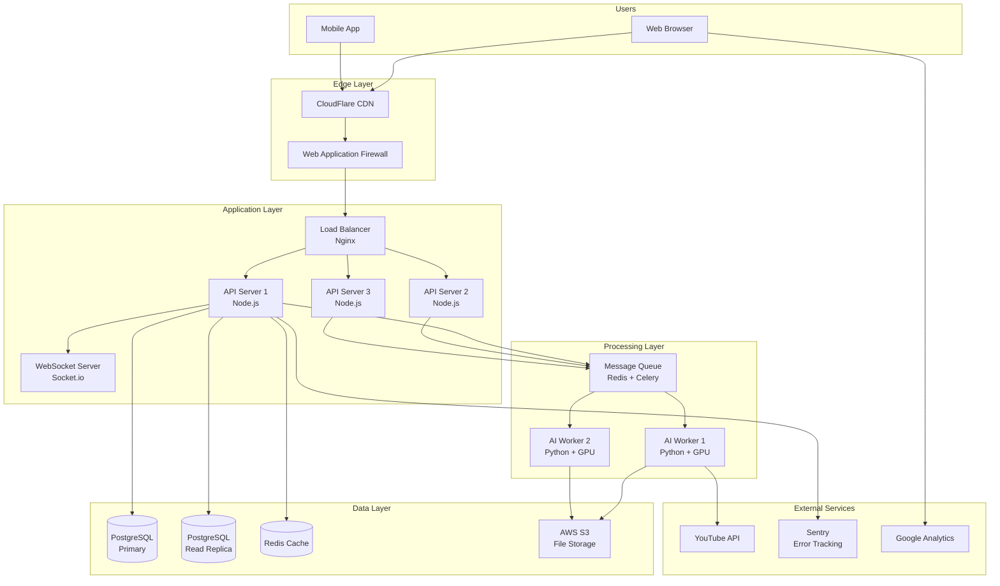
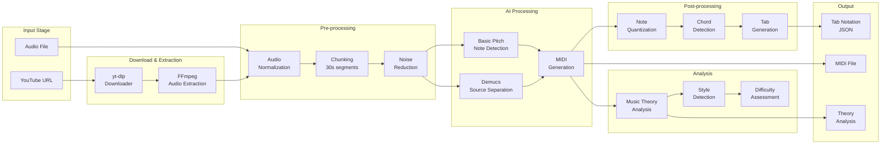
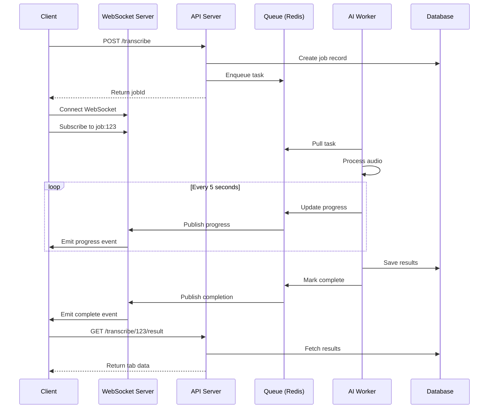
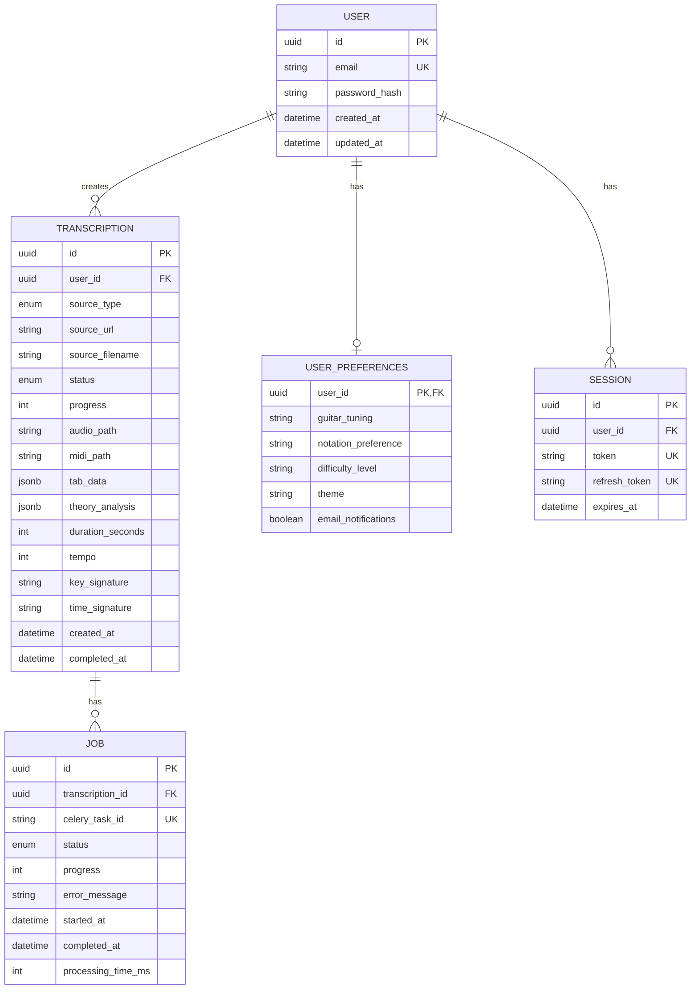
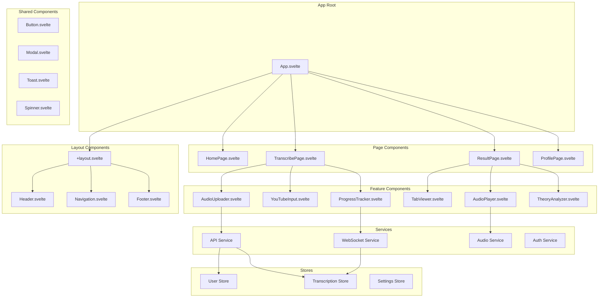
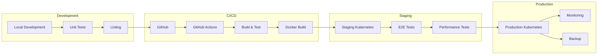
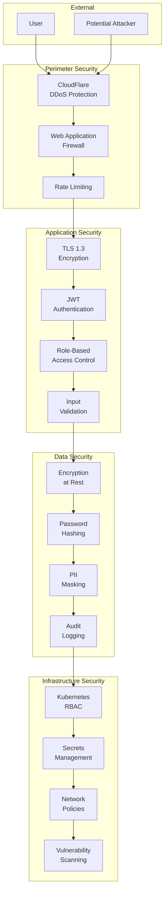
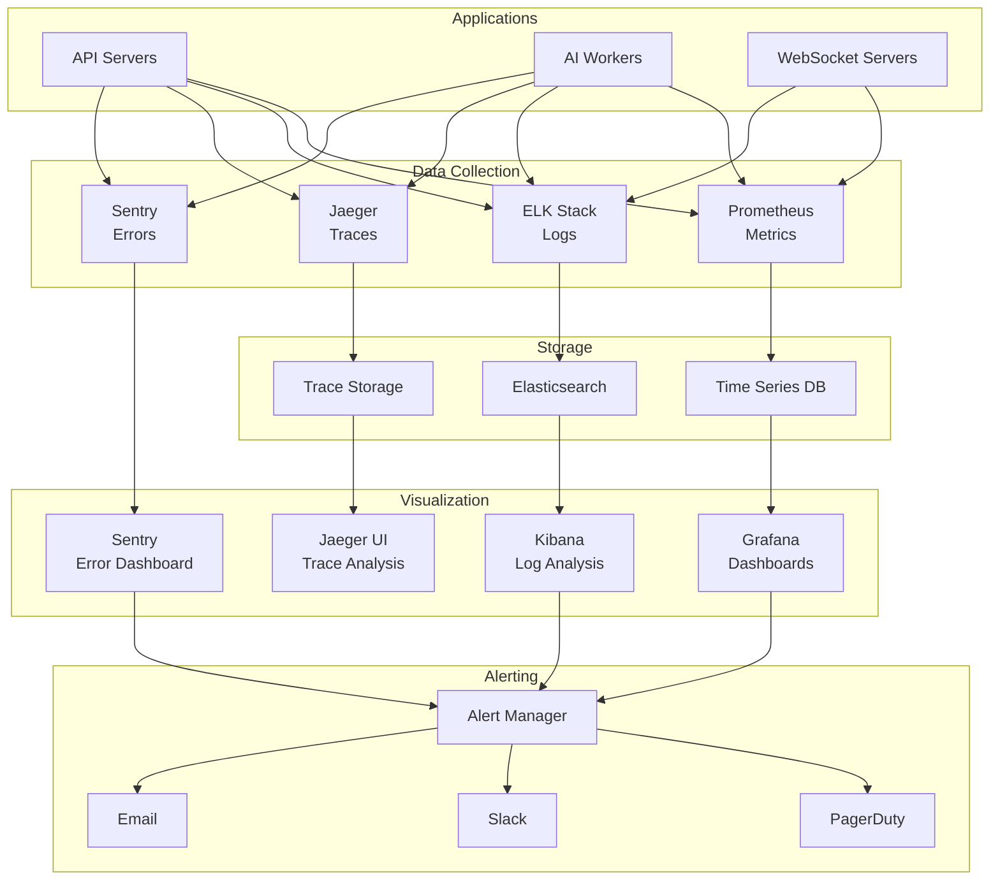

# Genesis Music - Architecture Diagrams

## 📊 System Architecture Diagrams

### 1. High-Level System Architecture


### 2. Audio Processing Pipeline


### 3. Real-time Communication Flow


### 4. Database Schema Relationships


### 5. Component Architecture (Frontend)


### 6. Deployment Pipeline


### 7. Security Architecture


### 8. Monitoring & Observability Stack


## 📐 Design Patterns

### 1. Circuit Breaker Pattern
```typescript
class CircuitBreaker {
  private failures = 0;
  private lastFailTime?: Date;
  private state: 'CLOSED' | 'OPEN' | 'HALF_OPEN' = 'CLOSED';
  
  async execute<T>(fn: () => Promise<T>): Promise<T> {
    if (this.state === 'OPEN') {
      if (Date.now() - this.lastFailTime > this.timeout) {
        this.state = 'HALF_OPEN';
      } else {
        throw new Error('Circuit breaker is OPEN');
      }
    }
    
    try {
      const result = await fn();
      this.onSuccess();
      return result;
    } catch (error) {
      this.onFailure();
      throw error;
    }
  }
}
```

### 2. Repository Pattern
```typescript
interface Repository<T> {
  findById(id: string): Promise<T | null>;
  findAll(filter?: Partial<T>): Promise<T[]>;
  create(data: Omit<T, 'id'>): Promise<T>;
  update(id: string, data: Partial<T>): Promise<T>;
  delete(id: string): Promise<void>;
}

class TranscriptionRepository implements Repository<Transcription> {
  // Implementation
}
```

### 3. Observer Pattern (WebSocket)
```typescript
class WebSocketManager {
  private subscribers = new Map<string, Set<(data: any) => void>>();
  
  subscribe(event: string, callback: (data: any) => void) {
    if (!this.subscribers.has(event)) {
      this.subscribers.set(event, new Set());
    }
    this.subscribers.get(event)!.add(callback);
  }
  
  emit(event: string, data: any) {
    const callbacks = this.subscribers.get(event);
    callbacks?.forEach(callback => callback(data));
  }
}
```

## 🔄 Data Flow Examples

### Successful Transcription Flow
```
1. User uploads audio file
2. Frontend validates file (size, format)
3. File uploaded to API server
4. API creates job record in database
5. Task queued in Redis/Celery
6. Worker picks up task
7. Audio downloaded/processed
8. Basic Pitch processes audio
9. MIDI generated and processed
10. Tab notation created
11. Theory analysis performed
12. Results saved to database
13. Files uploaded to S3
14. WebSocket notifies client
15. Client fetches and displays results
```

### Error Recovery Flow
```
1. Task fails during processing
2. Error logged to Sentry
3. Worker marks job as failed
4. Retry logic checks failure count
5. If retries < max_retries:
   - Re-queue with exponential backoff
   - Increment retry counter
6. Else:
   - Mark as permanently failed
   - Send failure notification
   - Clean up partial results
7. Client notified of failure
8. User presented with options:
   - Retry with different settings
   - Contact support
   - Try different audio
```