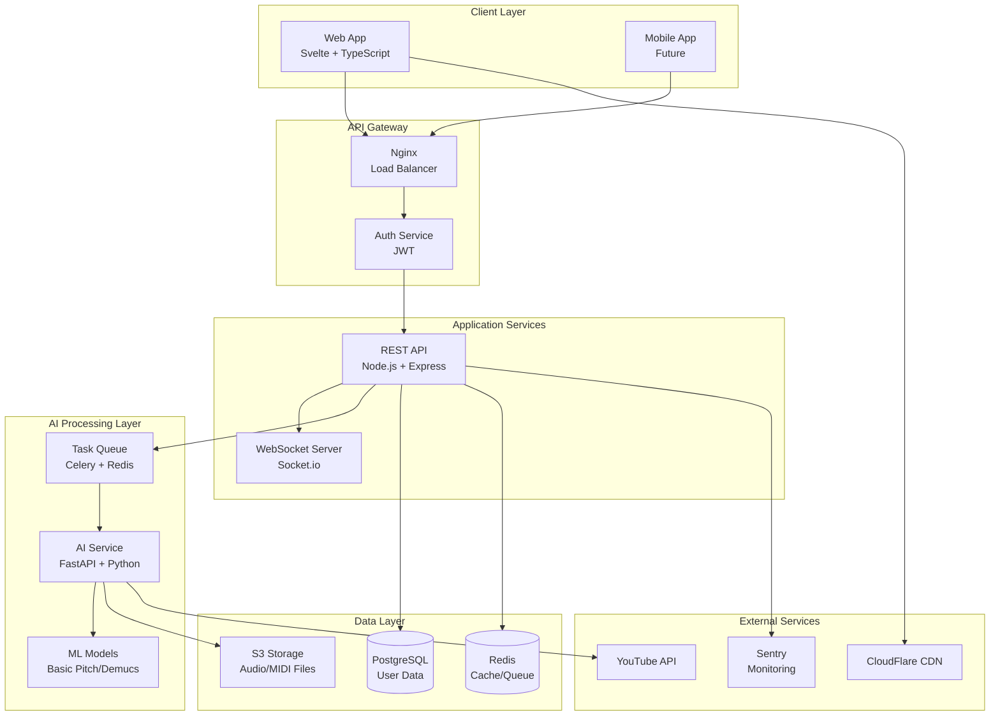
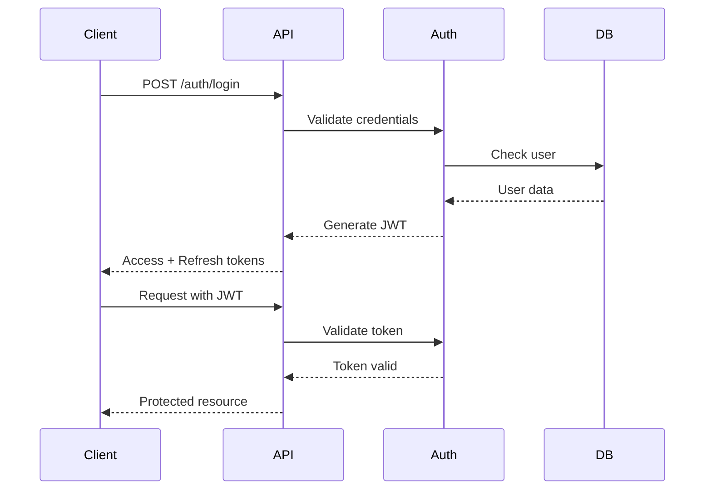

# Genesis Music - System Architecture Design

## 🏗️ System Architecture Overview

### Architecture Pattern: Microservices with Event-Driven Communication



## 🔄 Data Flow Architecture

### 1. Audio Processing Pipeline
```
User Input → API Gateway → Task Queue → AI Service → Storage → Client
```

### 2. Real-time Communication Flow
```
Client ↔ WebSocket Server ↔ Redis Pub/Sub ↔ AI Service Progress
```

### 3. Caching Strategy
```
Request → Redis Cache Check → Database Query → Cache Update → Response
```

## 🎯 Design Principles

### 1. Scalability
- **Horizontal Scaling**: Stateless services for easy scaling
- **Load Balancing**: Nginx for request distribution
- **Queue-Based Processing**: Async task handling with Celery
- **Caching**: Multi-level caching (CDN, Redis, Application)

### 2. Reliability
- **Circuit Breakers**: Prevent cascading failures
- **Retry Logic**: Exponential backoff for transient failures
- **Health Checks**: Kubernetes liveness/readiness probes
- **Graceful Degradation**: Fallback mechanisms for all services

### 3. Performance
- **Target Metrics**:
  - API Response: < 200ms (p95)
  - Audio Processing: < 30s for 3-min song
  - Page Load: < 3s on 3G
  - WebSocket Latency: < 100ms

### 4. Security
- **Authentication**: JWT with refresh tokens
- **Authorization**: Role-based access control (RBAC)
- **Data Encryption**: TLS 1.3 for transit, AES-256 for storage
- **Input Validation**: Schema validation at all entry points

## 🔌 Service Definitions

### 1. Frontend Service (Svelte)
```typescript
interface FrontendService {
  // Core Features
  audioUpload: FileUploadComponent;
  youtubeInput: URLInputComponent;
  tabViewer: VexFlowRenderer;
  audioPlayer: ToneJSPlayer;
  progressTracker: WebSocketClient;
  
  // State Management
  stores: {
    transcription: TranscriptionStore;
    user: UserStore;
    settings: SettingsStore;
  };
  
  // API Client
  api: {
    transcribe: (source: AudioSource) => Promise<JobId>;
    getStatus: (jobId: string) => Promise<JobStatus>;
    getResult: (jobId: string) => Promise<TabData>;
  };
}
```

### 2. Backend API Service (Node.js)
```typescript
interface BackendService {
  // REST Endpoints
  endpoints: {
    POST: '/api/transcribe';
    GET: '/api/transcribe/:id';
    GET: '/api/transcribe/:id/result';
    DELETE: '/api/transcribe/:id';
  };
  
  // WebSocket Events
  events: {
    'subscribe:job': (jobId: string) => void;
    'progress:update': (progress: number) => void;
    'job:complete': (result: TabData) => void;
    'job:error': (error: Error) => void;
  };
  
  // Middleware
  middleware: {
    authentication: JWTMiddleware;
    rateLimit: RateLimiter;
    validation: SchemaValidator;
    errorHandler: ErrorMiddleware;
  };
}
```

### 3. AI Processing Service (Python/FastAPI)
```python
class AIService:
    # Core Processing
    async def process_audio(self, audio_path: str) -> MIDIData:
        """Main audio processing pipeline"""
        pass
    
    # YouTube Processing
    async def download_youtube(self, url: str) -> str:
        """Download and extract audio from YouTube"""
        pass
    
    # Transcription
    async def transcribe_to_midi(self, audio: AudioData) -> MIDIData:
        """Convert audio to MIDI using Basic Pitch"""
        pass
    
    # Tab Generation
    async def generate_tab(self, midi: MIDIData) -> TabNotation:
        """Convert MIDI to guitar tab notation"""
        pass
    
    # Theory Analysis
    async def analyze_theory(self, midi: MIDIData) -> TheoryAnalysis:
        """Analyze harmony, key, and chord progressions"""
        pass
```

## 💾 Database Design

### PostgreSQL Schema
```sql
-- Users table
CREATE TABLE users (
    id UUID PRIMARY KEY DEFAULT gen_random_uuid(),
    email VARCHAR(255) UNIQUE NOT NULL,
    password_hash VARCHAR(255) NOT NULL,
    created_at TIMESTAMP DEFAULT CURRENT_TIMESTAMP,
    updated_at TIMESTAMP DEFAULT CURRENT_TIMESTAMP
);

-- Transcriptions table
CREATE TABLE transcriptions (
    id UUID PRIMARY KEY DEFAULT gen_random_uuid(),
    user_id UUID REFERENCES users(id) ON DELETE CASCADE,
    source_type VARCHAR(50) NOT NULL, -- 'youtube', 'upload'
    source_url TEXT,
    source_filename VARCHAR(255),
    status VARCHAR(50) NOT NULL, -- 'pending', 'processing', 'completed', 'failed'
    progress INTEGER DEFAULT 0,
    
    -- File paths
    audio_path TEXT,
    midi_path TEXT,
    
    -- Results
    tab_data JSONB,
    theory_analysis JSONB,
    
    -- Metadata
    duration_seconds INTEGER,
    tempo INTEGER,
    key_signature VARCHAR(10),
    time_signature VARCHAR(10),
    
    created_at TIMESTAMP DEFAULT CURRENT_TIMESTAMP,
    updated_at TIMESTAMP DEFAULT CURRENT_TIMESTAMP,
    completed_at TIMESTAMP,
    
    -- Indexes
    INDEX idx_user_id (user_id),
    INDEX idx_status (status),
    INDEX idx_created_at (created_at)
);

-- Jobs table (for async processing)
CREATE TABLE jobs (
    id UUID PRIMARY KEY DEFAULT gen_random_uuid(),
    transcription_id UUID REFERENCES transcriptions(id) ON DELETE CASCADE,
    celery_task_id VARCHAR(255) UNIQUE,
    status VARCHAR(50) NOT NULL,
    progress INTEGER DEFAULT 0,
    error_message TEXT,
    created_at TIMESTAMP DEFAULT CURRENT_TIMESTAMP,
    updated_at TIMESTAMP DEFAULT CURRENT_TIMESTAMP,
    
    INDEX idx_celery_task_id (celery_task_id),
    INDEX idx_status (status)
);

-- User preferences
CREATE TABLE user_preferences (
    user_id UUID PRIMARY KEY REFERENCES users(id) ON DELETE CASCADE,
    guitar_tuning VARCHAR(50) DEFAULT 'standard',
    notation_preference VARCHAR(50) DEFAULT 'tab', -- 'tab', 'standard', 'both'
    difficulty_level VARCHAR(50) DEFAULT 'intermediate',
    theme VARCHAR(50) DEFAULT 'light',
    email_notifications BOOLEAN DEFAULT true,
    created_at TIMESTAMP DEFAULT CURRENT_TIMESTAMP,
    updated_at TIMESTAMP DEFAULT CURRENT_TIMESTAMP
);
```

### Redis Data Structures
```yaml
# Cache Keys
cache:transcription:{id}  # Transcription result cache (TTL: 1 hour)
cache:user:{id}           # User data cache (TTL: 15 minutes)

# Session Storage
session:{token}           # User session data (TTL: 24 hours)

# Job Queue
celery:queue:default      # Default Celery queue
celery:queue:priority     # High-priority queue

# Real-time Updates
pubsub:job:{id}          # Job progress channel
pubsub:user:{id}         # User notification channel

# Rate Limiting
rate:api:{ip}            # API rate limiting (100 req/min)
rate:transcribe:{user}   # Transcription rate limiting (10/hour)
```

## 🔐 Security Architecture

### Authentication Flow


### Security Layers
1. **Network Security**
   - CloudFlare DDoS protection
   - WAF (Web Application Firewall)
   - TLS 1.3 encryption

2. **Application Security**
   - Input sanitization
   - SQL injection prevention
   - XSS protection
   - CSRF tokens

3. **Data Security**
   - Encryption at rest
   - PII data masking
   - Secure file storage
   - Audit logging

## 📊 Monitoring & Observability

### Metrics Collection
```yaml
Application Metrics:
  - API response times
  - Request throughput
  - Error rates
  - Queue depths

Infrastructure Metrics:
  - CPU/Memory usage
  - Disk I/O
  - Network throughput
  - Container health

Business Metrics:
  - Transcriptions per day
  - User registrations
  - Conversion rates
  - Feature usage
```

### Logging Strategy
```javascript
// Structured logging format
{
  "timestamp": "2025-01-09T10:00:00Z",
  "level": "INFO",
  "service": "api",
  "trace_id": "abc123",
  "user_id": "user456",
  "message": "Transcription started",
  "metadata": {
    "source": "youtube",
    "duration": 180
  }
}
```

## 🚀 Deployment Architecture

### Kubernetes Configuration
```yaml
apiVersion: apps/v1
kind: Deployment
metadata:
  name: genesis-music-api
spec:
  replicas: 3
  selector:
    matchLabels:
      app: api
  template:
    spec:
      containers:
      - name: api
        image: genesis-music/api:latest
        ports:
        - containerPort: 3001
        env:
        - name: NODE_ENV
          value: "production"
        resources:
          requests:
            memory: "256Mi"
            cpu: "250m"
          limits:
            memory: "512Mi"
            cpu: "500m"
        livenessProbe:
          httpGet:
            path: /health
            port: 3001
          initialDelaySeconds: 30
          periodSeconds: 10
        readinessProbe:
          httpGet:
            path: /ready
            port: 3001
          initialDelaySeconds: 5
          periodSeconds: 5
```

## 📈 Scaling Strategy

### Horizontal Scaling Triggers
- **API Service**: CPU > 70% or Memory > 80%
- **AI Service**: Queue depth > 100 or processing time > 60s
- **WebSocket**: Connection count > 1000 per instance

### Vertical Scaling Limits
- **API**: Max 2 CPU, 4GB RAM per pod
- **AI Service**: Max 4 CPU, 8GB RAM, 1 GPU per pod
- **Database**: Max 16 CPU, 64GB RAM (managed service)

## 🔄 Disaster Recovery

### Backup Strategy
- **Database**: Daily automated backups, 30-day retention
- **File Storage**: S3 cross-region replication
- **Configuration**: Git-based config management

### Recovery Objectives
- **RTO (Recovery Time Objective)**: < 4 hours
- **RPO (Recovery Point Objective)**: < 1 hour
- **Failover**: Automatic with health checks

## 📝 Development Guidelines

### API Design Standards
- RESTful principles
- Consistent naming conventions
- Versioning through headers
- Comprehensive error responses

### Code Organization
```
genesis-music/
├── frontend/          # Svelte application
├── backend/           # Node.js API
├── ai-models/         # Python AI services
├── infrastructure/    # Kubernetes, Terraform
├── docs/             # Documentation
└── tests/            # E2E tests
```

### Testing Strategy
- Unit tests: > 80% coverage
- Integration tests: All API endpoints
- E2E tests: Critical user flows
- Performance tests: Load testing with k6